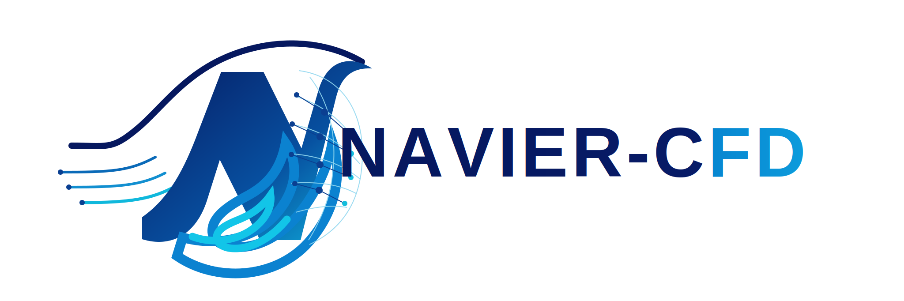
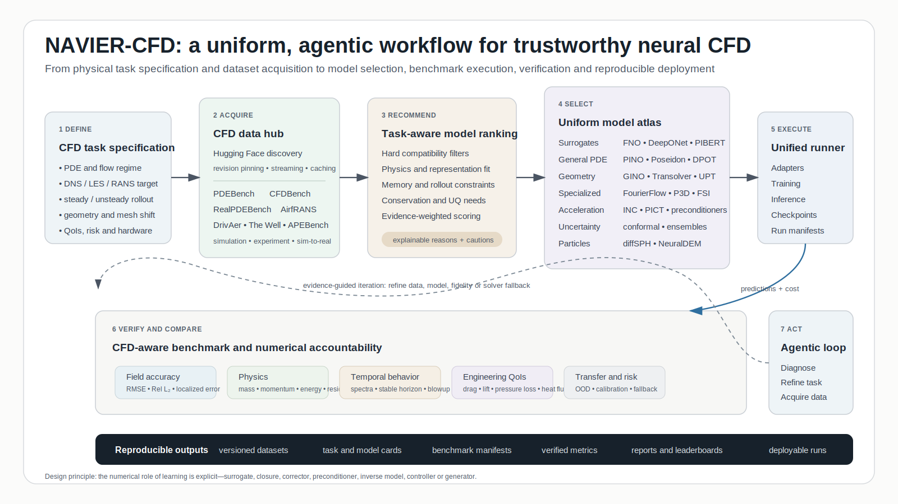

<p align="center">
  
</p>

<h1 align="center">NAVIER-CFD</h1>

<p align="center"><strong>Neural and Agentic Verification, Integration, Evaluation, and Recommendation for Computational Fluid Dynamics</strong></p>

<p align="center">
  <a href="https://github.com/Samsomyajit/NAVIER-CFD/releases"></a>
  <a href="https://pypi.org/project/navier-cfd/"></a>
  <a href="https://pypi.org/project/navier-cfd/"></a>
  <a href="LICENSE"></a>
  <a href="https://github.com/Samsomyajit/NAVIER-CFD/actions/workflows/ci.yml"></a>
  <a href="https://samsomyajit.github.io/NAVIER-CFD/"></a>
  <a href="https://samsomyajit.github.io/NAVIER-CFD/recommender/"></a>
  
  
  
</p>

NAVIER-CFD is a CFD-first Python platform and project website for neural PDE solvers, hybrid numerical acceleration, benchmark datasets, paper-evidence-aware task recommendation, Hugging Face integration, and agentic experiment planning.

## Project website and interactive tool

- **Project website:** https://samsomyajit.github.io/NAVIER-CFD/
- **Interactive model and dataset recommender:** https://samsomyajit.github.io/NAVIER-CFD/recommender/
- **Technical documentation:** https://samsomyajit.github.io/NAVIER-CFD/docs/

The web recommender runs entirely in the browser. It applies hard compatibility filters, explains every score, recommends suitable benchmark datasets, and exports a reproducible run manifest.

> A recommendation is a task-specific hypothesis, not proof that one architecture is universally superior. Report the final score together with evidence confidence, metric coverage, matched paper records, and the target benchmark.

## Evidence-aware recommendation

Version 0.2 introduces a traceable paper-result layer. Each quantitative claim is stored with the paper, benchmark, metric, baseline, physical regime, dimension, mesh, geometry, temporal mode, fidelity, code/data availability, evidence level, and caveats.

The recommender now combines:

1. **Hard compatibility filtering** for dimension, representation, geometry/mesh transfer, numerical role, temporal mode, and hardware.
2. **Task-to-paper similarity** across physics, discretization, geometry, temporal regime, role, and fidelity.
3. **Metric-aware utility** that prefers same-pipeline baseline comparisons and refuses to compare scale-dependent absolute MSE values across unrelated datasets.
4. **Evidence quality weighting** for independent reproduction, peer review, code/data availability, cases, seeds, and baseline quality.
5. **Bayesian shrinkage** toward a neutral prior when evidence is sparse.
6. **Confidence and coverage reporting** so a high score with one weak paper cannot masquerade as a mature result.

Citation counts, venue prestige, author prestige, and coauthorship centrality are deliberately excluded from performance scoring. Bibliometrics are used for paper discovery and provenance, not as a proxy for CFD accuracy.

See [Evidence Scoring](docs/EVIDENCE_SCORING.md) and the frozen catalog at `src/navier_cfd/data/paper_evidence.json`.

## Scientific pipeline

<p align="center">
  
</p>

The workflow keeps the learned numerical role explicit—surrogate, closure, corrector, preconditioner, inverse model, controller, or generator—and connects each experiment to versioned data, traceable model cards, CFD-aware metrics, paper evidence, and a reproducible run manifest.

## Why NAVIER-CFD

- **55-model taxonomy:** acceleration frameworks, surrogates, general PDE solvers, specialized CFD, geometry and unstructured-mesh models, foundation models, inverse methods, uncertainty, particle and multiphase models, and generative methods.
- **11 first-class datasets:** PDEBench, CFDBench, RealPDEBench, AirfRANS, DrivAerNet++, DrivAerML, The Well, APEBench, ScalarFlow, ShapeNet-Car, and EAGLE.
- **Paper-level evidence:** traceable benchmark claims with task context, provenance, quality, confidence, and comparability limits.
- **Full Hugging Face support:** discovery, inspection, selective downloads, revision pinning, authentication, streaming, caching, and arbitrary CFD dataset identifiers.
- **Explainable recommendation:** compatibility filtering plus evidence-aware ranking by physics, dimension, mesh, geometry, temporal regime, numerical role, fidelity, memory, conservation, uncertainty, and transfer requirements.
- **Agentic AI:** deterministic offline planning and provider-neutral interfaces for external LLM agents.
- **CFD-aware benchmarking:** field, spectral, rollout, conservation, OOD, quantity-of-interest, uncertainty, wall-clock, memory, and break-even metrics.
- **Safe integration:** external repositories remain metadata-first and are never executed automatically.

## Installation

From PyPI:

```bash
pip install navier-cfd
```

From source:

```bash
git clone https://github.com/Samsomyajit/NAVIER-CFD.git
cd NAVIER-CFD
pip install -e .

# development, tests, and documentation
pip install -e ".[dev,docs]"
```

## Quick start

```bash
# Explore catalogs
navier models list
navier models list --category acceleration
navier datasets list

# Inspect registered paper evidence
navier evidence list
navier evidence list --model-id gino
navier evidence coverage

# Search Hugging Face
navier datasets discover "computational fluid dynamics" --limit 20

# Download a CFDBench subset
navier datasets download cfdbench \
  --local-dir ./data/cfdbench \
  --pattern "cylinder/**"

# Evidence-aware recommendation
navier recommend \
  --problem vehicle_drag \
  --task surrogate \
  --dimension 3 \
  --mesh point_cloud \
  --temporal steady \
  --geometry varying \
  --physics aerodynamics \
  --fidelity rans \
  --memory-gb 80 \
  --top-k 10

# Generate an agentic experiment plan
navier agent plan \
  "Benchmark RealPDEBench cylinder sim-to-real forecasting with 24 GB VRAM, conservation and uncertainty"
```

## Python API

```python
from navier_cfd import Catalog, TaskSpec, recommend_models

catalog = Catalog.load_builtin()
task = TaskSpec(
    problem="3d_vehicle_aerodynamics",
    task_type="surrogate",
    dimension=3,
    mesh_type="point_cloud",
    temporal_mode="steady",
    geometry_mode="varying",
    physics=("aerodynamics",),
    fidelity="rans",
    requires_geometry_transfer=True,
    requires_mesh_transfer=True,
    hardware_memory_gb=80,
)

for result in recommend_models(task, catalog.models, top_k=8):
    print(result.model.name, result.score)
    print("evidence:", result.evidence_score)
    print("confidence:", result.evidence_confidence)
    print("coverage:", result.evidence_coverage)
    print("records:", result.evidence_count)
    print("reasons:", result.reasons)
    print("cautions:", result.cautions)
```

## Registered model families

- **Physics-informed:** PINN, NSFnets, PINNsFormer, PINO, PI-MFM, and RiemannONet.
- **Operator learning:** DeepONet, MIONet, Fourier-DeepONet, Fourier-MIONet, FNO, F-FNO, U-FNO, U-NO, LSM, MWT, Laplace NO, and state-space NO.
- **Geometry and transformer solvers:** Geo-FNO, GINO, GNOT, Transolver, UPT, MeshGraphNets, DoMINO, and ReViT.
- **CFD-specialized:** PIBERT, FourierFlow, P3D, AeroTransformer, NeuralDEM, DeepM&Mnet, and Energy Transformer.
- **Foundation and generative:** DPOT, Poseidon, PROSE-FD, BCAT, PDEformer-1, Tadpole, PDE-Refiner, FunDiff, and Flow Matching for PDEs.
- **Acceleration:** Solver-in-the-Loop, INC, PICT, diffSPH, NeuroSEM, neural-operator preconditioned Newton, and geometry-aware neural preconditioning.
- **Uncertainty and adaptation:** Conformalized-DeepONet and TANTE.

“Included” means represented through a uniform model card and recommendation interface. Official implementations remain external so upstream licenses and revisions are respected.

## Repository map

```text
src/navier_cfd/
  agents/          deterministic and LLM-ready planning
  benchmarks/      CFD metrics and benchmark plans
  datasets/        Hugging Face discovery, download, streaming
  models/          safe adapter protocol
  data/            frozen paper-evidence catalog
  catalogs.py      model and dataset registries
  evidence.py      task similarity, quality, utility, shrinkage
  recommender.py   compatibility prior + evidence ranking

website/
  index.html       standalone project website
  recommender/     interactive browser recommender
  data/            static model and dataset catalogs

docs/              MkDocs technical documentation
case_studies/      detailed benchmark study guides
configs/tasks/     reusable task specifications
```

## Recommender validation

The Python recommender is covered by `pytest`; the browser engine is covered by Node's built-in test runner.

```bash
pytest tests/test_recommender.py tests/test_evidence_recommender.py
node --test website/recommender/recommender-core.test.mjs
```

Canonical tests verify task-specific evidence transfer, geometry-aware 3D ranking, hybrid acceleration selection, evidence provenance, and neutral treatment of incomparable absolute MSE values.

## Packaging and deployment

- Package: `navier-cfd`
- Import namespace: `navier_cfd`
- Current version: `0.2.0`
- Evidence algorithm: `0.2.0-evidence`
- Build backend: Hatchling
- Website source: `website/`
- Documentation source: `docs/`
- Branch publisher: `.github/workflows/pages-branch.yml`
- PyPI Trusted Publishing workflow: `.github/workflows/publish-pypi.yml`

## License

Licensed under the [Apache License 2.0](LICENSE). Cite NAVIER-CFD and the original model, dataset, upstream implementation, benchmark, and numerical-solver references used in every experiment.
