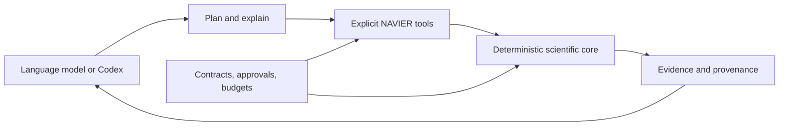

# Agentic AI and NAVIER AutoResearch

NAVIER-CFD contains an early agentic planning layer and, in release 1.1.0, a persistent Codex-integrated AutoResearch foundation.

The platform separates language-model reasoning from deterministic scientific execution.



## Existing planner

The provider-neutral `AgentOrchestrator` converts a natural-language CFD objective into:

- an interpreted task;
- a relevant dataset family;
- hard-filtered model compatibility;
- an evidence-aware model shortlist;
- a benchmark and ablation plan;
- reasons and cautions.

It can operate offline and does not send data, files, credentials, or private results to an LLM by default.

```python
from navier_cfd.agents import AgentOrchestrator

agent = AgentOrchestrator()
plan = agent.plan(
    "Benchmark sim-to-real cylinder wake forecasting on RealPDEBench, "
    "24 GB GPU, conservation and uncertainty required"
)
print(plan.to_dict())
```

## AutoResearch upgrade

NAVIER AutoResearch adds:

1. `ResearchObjective` and `ResearchContract`;
2. resource ceilings and deterministic stop policies;
3. assistant, guided, and bounded modes;
4. persistent action proposals and approvals;
5. findings, decisions, and resource accounting;
6. Codex repository skills;
7. a local read-only MCP server;
8. deterministic CFD diagnostics;
9. FigureLab specifications, audits, renderers, and manifests.

## Current agentic capability levels

| Level | Capability | Status |
|---|---|---|
| 0 | Static model and dataset library | implemented |
| 1 | Natural-language task interpretation | implemented |
| 2 | Structured model and benchmark planning | implemented |
| 3 | Tool-using analysis and persistent governance | foundation implemented |
| 4 | Iterative approved execution and replanning | session foundation; execution adapters future |
| 5 | Solver-connected active data generation | future |
| 6 | Autonomous laboratory operation | outside current scope |

The v1.1.0 release should be described as a **scientifically governed AutoResearch foundation**, not a complete autonomous scientist.

## Current MCP tools

- dataset catalogue listing;
- model catalogue listing;
- deterministic research planning;
- evidence-aware model recommendation;
- metric-suite listing;
- figure-spec auditing.

See [AutoResearch MCP tools](AUTORESEARCH_TOOLS.md).

## Current Codex skills

- define a research problem;
- audit CFD data;
- run bounded AutoResearch;
- diagnose CFD results;
- generate research figures;
- review scientific validity.

See [Codex skills](CODEX_SKILLS.md).

## Scientific boundary

The language model may:

- interpret goals;
- select skills;
- propose hypotheses;
- choose deterministic tools;
- explain calculated results;
- prepare code and reports.

NAVIER-CFD must:

- validate schemas;
- calculate metrics and diagnostics;
- enforce compatibility;
- score registered evidence;
- track provenance;
- enforce approvals and budgets;
- apply stop policies;
- audit figure specifications.

The language model must not invent:

- units;
- boundary conditions;
- field semantics;
- solver settings;
- physics metrics;
- experimental evidence;
- benchmark results.

## Read-only safety boundary

The v1.1.0 MCP server does not automatically expose:

- training;
- package installation;
- downloads;
- OpenFOAM, MFiX, or DEM execution;
- Slurm submission;
- file overwrites;
- deletion;
- arbitrary shell commands.

Future execution connectors must use the same research contract, risk classification, approval records, budgets, and provenance requirements.

## Complete documentation

Start with [NAVIER AutoResearch and Codex integration](AUTORESEARCH.md).
