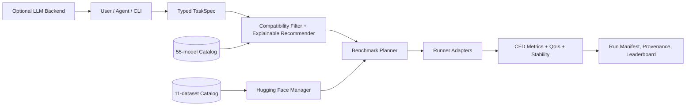

# Architecture

## Layers

1. **Task layer:** physics, dimensionality, mesh, geometry, fidelity, temporal regime, hardware, and safety requirements.
2. **Catalog layer:** explicit model and dataset capabilities, references, and limitations.
3. **Data layer:** Hugging Face discovery, revision-pinned download, streaming, filtering, and caching.
4. **Recommendation layer:** hard compatibility filtering followed by explainable ranking.
5. **Execution layer:** native components and explicit adapters to official external implementations.
6. **Evaluation layer:** field, spectral, temporal, conservation, QoI, UQ, OOD, and cost metrics.
7. **Agent layer:** deterministic planning plus a provider-neutral LLM hook.

## Security boundary
External repositories are metadata-first. NAVIER-CFD does not clone, install, import, or execute third-party code automatically.
