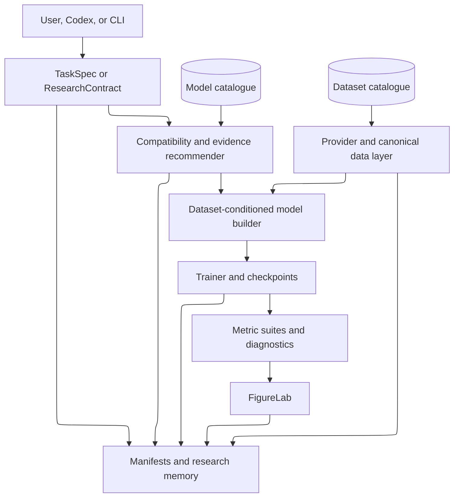
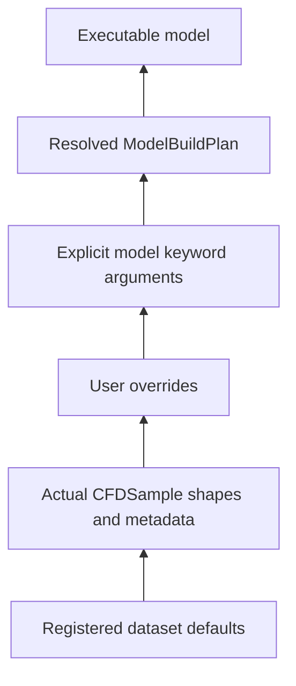
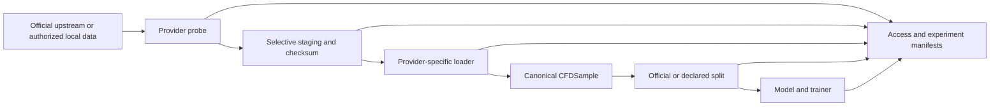
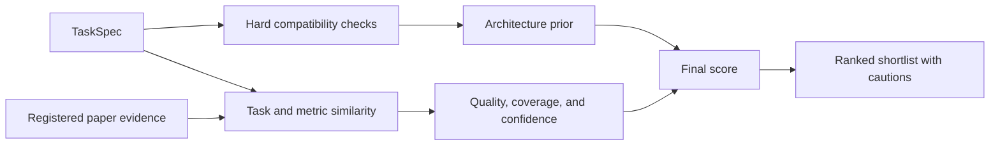
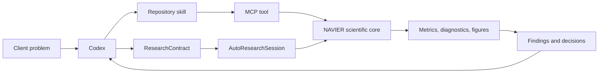

# NAVIER-CFD architecture


NAVIER-CFD is a layered platform. The model and dataset catalogues are not the platform by themselves; they are connected to canonical data adaptation, dataset-conditioned construction, training, physical evaluation, evidence-aware recommendation, and the AutoResearch governance layer.

## Platform flow



## Core layers

1. **Task layer** — physics, dimensionality, mesh, geometry, fidelity, temporal regime, hardware, generalization, and safety requirements.
2. **Catalogue layer** — explicit model and dataset capabilities, references, evidence, and limitations.
3. **Provider layer** — official-source probing, selective staging, authentication resolution, safe local loading, and access provenance.
4. **Canonical data layer** — `CFDSample`, `CFDBatch`, coordinates, masks, fields, parameters, and metadata.
5. **Construction layer** — dataset defaults, actual sample inference, user overrides, and model-specific translation.
6. **Recommendation layer** — hard compatibility filtering followed by task-matched paper-evidence scoring.
7. **Execution layer** — native model references, trainers, checkpoints, experiments, and explicit external adapters.
8. **Evaluation layer** — numerical, spectral, temporal, physical, profile, stability, and efficiency metrics.
9. **Analysis layer** — CFD diagnostics, error localization, and research-grade figures.
10. **Agent layer** — deterministic planning, Codex skills, MCP tools, contracts, approvals, budgets, and stopping rules.
11. **Evidence layer** — experiment manifests, upstream manifests, figure manifests, AutoResearch JSONL history, and hashes.

## Dataset-conditioned construction



Higher layers override lower layers. The resolved build plan records the final interpretation.

## Dataset path



## Recommendation path



## AutoResearch path



For the full agent architecture, see [AutoResearch architecture](AUTORESEARCH_ARCHITECTURE.md).

## Security boundaries

### External code

External repositories are metadata-first. NAVIER-CFD does not clone, install, import, or execute third-party code merely because a model is registered.

### Dataset access

Official-source staging uses:

- registered upstream hosts;
- transfer-size ceilings;
- SHA-256 manifests;
- checksum verification where published;
- safe archive extraction;
- no credential or license bypass.

### Agent tools

The v1.1.0 MCP surface is read-only. High-cost and destructive execution must use explicit approved adapters.

### Scientific validity

Unsupported physical metrics are marked invalid rather than fabricated. Units, axes, masks, and normalization remain explicit parts of the evaluation contract.

## Package map

```text
src/navier_cfd/
├── agents/          # deterministic task interpretation and planning
├── autoresearch/    # contracts, sessions, MCP server, tools, CLI
├── catalogs/        # model and dataset metadata
├── datasets/        # providers, canonical samples, splits, loading
├── diagnostics/     # deterministic CFD failure analysis
├── evidence/        # paper-level evidence records and scoring
├── figures/         # FigureSpec, audits, renderers, manifests
├── metrics/         # numerical, spectral, and physics suites
├── models/          # model hub and dataset-conditioned builders
├── training/        # common trainer and training results
├── checkpoints/     # portable checkpoints and manifests
└── experiment.py    # high-level end-to-end experiment API
```
