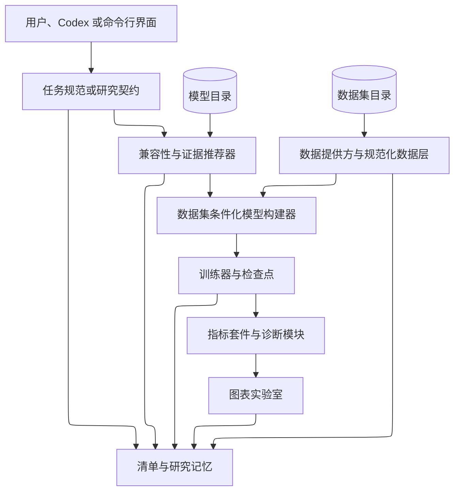

# 平台架构

NAVIER-CFD 采用分层设计，使数据、模型、训练、评价、证据和智能体功能彼此解耦。

## 主要层次
Platform:


```text
用户任务与命令行 / Python API
                ↓
推荐器与实验编排
                ↓
模型配置翻译与 ModelHub
                ↓
数据集适配器与规范化批处理
                ↓
训练器、检查点和 CFD 指标
                ↓
论文证据、模型卡和运行清单
```

## 数据层

数据层将不同来源的结构化网格、点云和非结构网格转换为 `CFDSample` 和 `CFDBatch`。

核心对象：

- `AdapterRegistry`
- `AdaptedDataset`
- `CFDSample`
- `CFDBatch`
- `make_dataloaders`

## 模型层

模型层由以下部分组成：

- 原生 PyTorch 参考实现；
- `ModelHub` 统一状态和构造接口；
- 数据集—模型配置翻译；
- 外部官方实现适配器；
- 一致性验证工具。

## 训练与评价层

`CFDTrainer` 负责优化器、损失、调度器、混合精度、梯度裁剪、早停和检查点。

评价层包括场误差、谱误差、散度、动能和时间滚动误差。阻力、升力和壁面剪切等积分量需要数据集特定的几何信息与积分规则。

## 证据和推荐层

模型目录描述“模型是什么”，证据目录描述“模型在什么条件下取得了什么结果”，推荐器则回答“针对当前任务应该先测试哪些模型”。

## 智能体层

智能体层生成可审计实验计划，但不会绕过硬兼容性检查、数据许可证或数值验证。所有建议应转化为可重复配置和明确的评估协议。

## 可扩展性原则

新增模型时应提供：

1. 模型卡；
2. 构造器或外部入口；
3. 数据集配置翻译；
4. 前向和反向测试；
5. 检查点与许可证说明；
6. 至少一个目标基准验证。

新增数据集时应提供：

1. 数据卡和来源；
2. 字段映射；
3. 坐标、掩码和参数定义；
4. 正式划分；
5. 归一化方法；
6. 可复现下载或修订标识。
