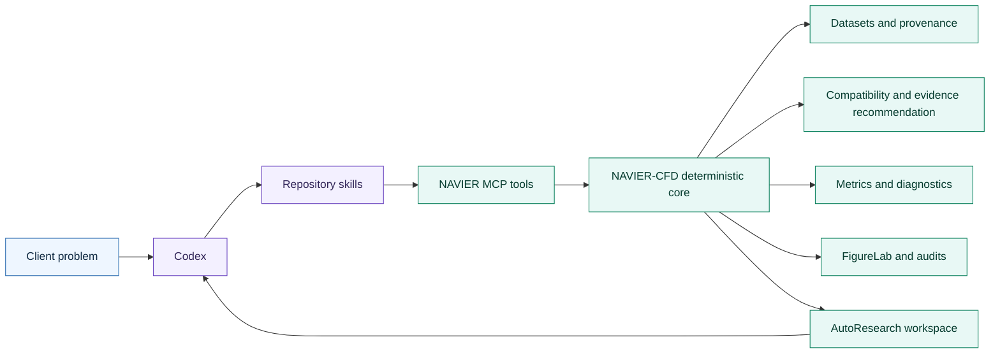
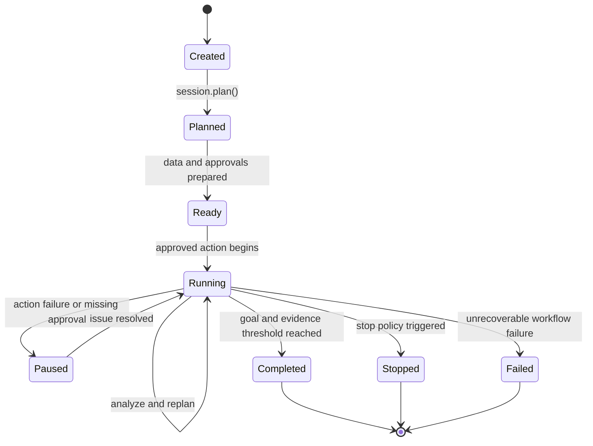
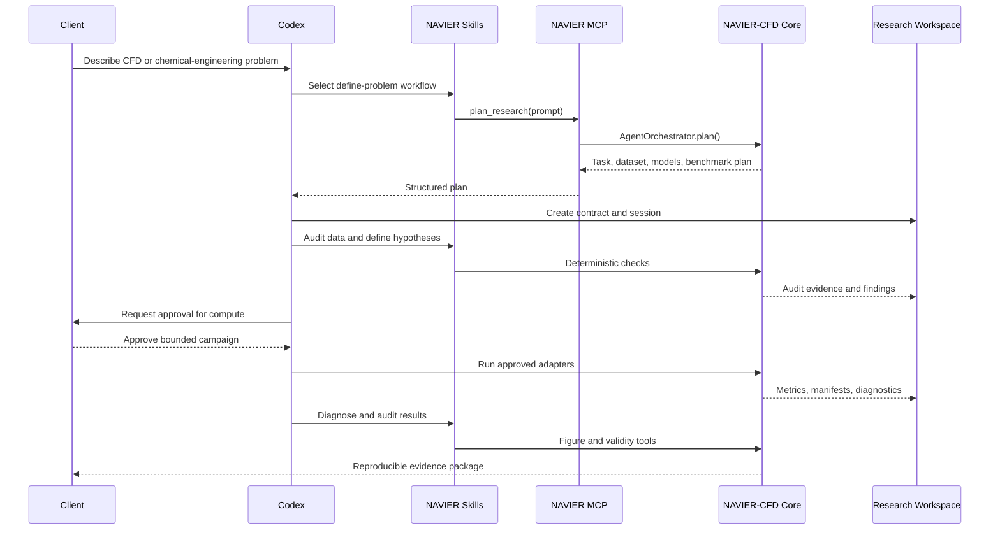

# NAVIER AutoResearch and Codex integration

NAVIER-CFD 1.1.0 adds a scientifically governed agent layer for turning a client CFD or chemical-engineering problem into a structured, reproducible research campaign.

The central rule is:

> **Codex plans, explains, writes code, and calls explicit tools. NAVIER-CFD performs deterministic scientific operations, validates assumptions, enforces permissions and budgets, and records the evidence.**

NAVIER AutoResearch is not an unrestricted “AI scientist.” It is an approval-aware research-control layer built around the existing NAVIER-CFD planner, dataset providers, model catalogue, evidence-aware recommender, trainer, metrics, diagnostics, checkpoints, and manifests.

## Documentation map

| Topic | Guide |
|---|---|
| System components and data flow | [AutoResearch architecture](AUTORESEARCH_ARCHITECTURE.md) |
| MCP tool schemas and examples | [AutoResearch tools](AUTORESEARCH_TOOLS.md) |
| Codex skills and activation guidance | [Codex skills](CODEX_SKILLS.md) |
| Contracts, approvals, budgets, and stopping | [Research sessions](AUTORESEARCH_SESSIONS.md) |
| Deterministic field and interface analysis | [CFD diagnostics](CFD_DIAGNOSTICS.md) |
| Publication-grade plotting and figure auditing | [NAVIER FigureLab](FIGURELAB.md) |
| Release summary | [Release 1.1.0](RELEASE_1_1_0.md) |

## Scientific operating model



The language model is never the numerical source of truth. For example:

- Codex may decide that divergence is relevant; NAVIER-CFD must calculate it.
- Codex may decide to inspect bubble-interface errors; NAVIER-CFD must construct the declared mask and compute the conditioned metrics.
- Codex may propose a new training run; the `ResearchContract` decides whether approval is required.
- Codex may request a paper figure; `FigureSpec`, the renderer, and the figure audit control the output and provenance.

## Install

Core AutoResearch, MCP, and FigureLab dependencies:

```bash
pip install "navier-cfd[autoresearch]"
```

For a repository checkout:

```bash
pip install -e ".[autoresearch,dev]"
```

Confirm the installed version:

```bash
navier version
navier-autoresearch --help
```

## Start a research campaign

```bash
navier-autoresearch init \
  "Reconstruct gas and solids velocities from EP_G history across unseen gas velocities" \
  --workspace runs/bubblenet-autoresearch \
  --domain gas_solid_multiphase \
  --mode guided \
  --max-gpu-hours 24 \
  --max-experiments 12 \
  --max-iterations 8
```

This command:

1. creates a `ResearchObjective`;
2. creates a `ResearchContract`;
3. records the budget and stopping policy;
4. invokes the existing deterministic `AgentOrchestrator`;
5. writes a research plan and session state;
6. leaves compute and external actions behind approval boundaries.

The initial workspace contains:

```text
runs/bubblenet-autoresearch/
├── research_contract.json
├── research_plan.json
├── session_state.json
├── actions.jsonl
├── proposals.jsonl
├── approvals.jsonl
├── findings.jsonl
└── decisions.jsonl
```

Additional result, checkpoint, diagnostic, and figure directories may be added by approved execution adapters.

## AutoResearch lifecycle



The v1.1.0 `AutoResearchSession` records this state but deliberately does not execute arbitrary commands. Execution is delegated to explicit tools or host integrations.

## Research modes

| Mode | Intended use | Default behavior |
|---|---|---|
| `assistant` | High-control or high-risk work | Every non-read action requires approval. |
| `guided` | Normal research campaigns | Reads are automatic; writes, compute, network access, and destructive operations require approval. |
| `bounded` | Pre-approved repetitive research | The agent may operate only inside an explicit tool allowlist, resource budget, and stop policy. |

No mode can override:

- `denied_tools`;
- destructive-operation approval;
- hard resource ceilings;
- deterministic stopping rules;
- invalid scientific assumptions.

See [Research sessions](AUTORESEARCH_SESSIONS.md) for the complete approval model.

## Codex MCP integration

NAVIER-CFD includes a local STDIO MCP server.

Copy the project configuration example:

```bash
cp .codex/config.toml.example .codex/config.toml
```

The server command is:

```bash
navier-autoresearch mcp
```

The v1.1.0 read-only MCP surface exposes:

- `list_datasets`
- `list_models`
- `plan_research`
- `recommend_models`
- `list_metric_suites`
- `audit_figure_spec`

Detailed schemas, responses, and examples are documented in [AutoResearch tools](AUTORESEARCH_TOOLS.md).

Training, OpenFOAM/MFiX/DEM execution, Slurm submission, large downloads, overwrites, and deletion are intentionally absent from the v1.1.0 automatic tool surface.

## Repository skills

Codex discovers project-specific workflows under `.agents/skills`.

NAVIER-CFD 1.1.0 includes:

- `navier-define-research-problem`
- `navier-audit-cfd-data`
- `navier-run-autoresearch`
- `navier-diagnose-cfd-results`
- `navier-generate-research-figures`
- `navier-review-scientific-validity`

A skill describes **how to conduct a workflow**. An MCP tool performs **one deterministic operation**. The distinction prevents long scientific procedures from being hidden inside opaque tool calls.

See [Codex skills](CODEX_SKILLS.md).

## Programmatic API

```python
from navier_cfd import (
    AutoResearchSession,
    ResearchBudget,
    ResearchMode,
    StopPolicy,
)

session = AutoResearchSession.create(
    "runs/client-project",
    "Predict pressure drop and temperature fields for unseen heat-exchanger geometries",
    domain="heat_transfer",
    mode=ResearchMode.GUIDED,
    budget=ResearchBudget(
        max_gpu_hours=20,
        max_cpu_hours=60,
        max_storage_gb=100,
        max_experiments=10,
    ),
    stop_policy=StopPolicy(
        min_improvement_percent=1.0,
        patience_iterations=3,
        max_iterations=10,
    ),
    inputs=("geometry", "inlet_velocity", "inlet_temperature"),
    targets=("pressure_drop", "temperature_field"),
    generalization=("unseen_geometry",),
    success_metrics=("relative_l2", "pressure_drop_error"),
)

plan = session.plan()
print(plan["planner"]["recommended_models"])
```

Propose an action:

```python
from navier_cfd import ActionRisk

proposal = session.propose_action(
    name="Train FNO baseline",
    tool="navier.train_model",
    risk=ActionRisk.COMPUTE,
    reason="Establish a structured-grid neural-operator baseline",
    arguments={"model": "fno", "epochs": 100},
    estimated_cost={"gpu_hours": 2.0},
)
```

Check and record approval:

```python
assert not session.can_execute(proposal.id)

session.approve(
    proposal.id,
    approved=True,
    actor="principal_investigator",
    note="Approved within the 24 GPU-hour campaign budget",
)

assert session.can_execute(proposal.id)
```

Record the result and resource usage:

```python
session.record_action_result(
    proposal.id,
    success=True,
    result={"run_manifest": "runs/fno-baseline/run_manifest.json"},
)
session.update_usage(gpu_hours=1.8, storage_gb=2.4, experiments=1)
```

Add an evidence-linked finding:

```python
session.add_finding(
    "computed_result",
    "The FNO baseline preserves the mean profile but loses high-frequency interface structures.",
    evidence=(
        "runs/fno-baseline/metrics.json",
        "runs/fno-baseline/figures/interface_error.pdf",
    ),
    confidence="high",
)
```

Evaluate stopping conditions:

```python
decision = session.evaluate_iteration(
    improvement_percent=0.4,
    physics_valid=True,
)
print(decision)
```

## Typical client workflow



## What is autonomous in v1.1.0?

The release supports autonomy in:

- task interpretation;
- dataset and model catalogue inspection;
- deterministic plan generation;
- evidence-aware recommendation;
- research workspace and state management;
- action proposals and approval checks;
- budget tracking;
- deterministic stopping decisions;
- findings and decision logging;
- figure-spec and scientific-integrity auditing.

The release does not autonomously:

- execute arbitrary shell commands;
- launch training without an explicit adapter and approval;
- submit Slurm jobs;
- run CFD, MFiX, or DEM solvers;
- download large datasets without an approved connector;
- modify official benchmark splits;
- delete or overwrite research assets.

## Scientific boundaries

- AutoResearch cannot manufacture missing measurements or metadata.
- A plan is a hypothesis-driven research proposal, not proof that a model will perform well.
- Recommendations remain conditional on catalogue metadata and registered evidence.
- Physics metrics are valid only when their required axes, coordinates, spacing, fields, masks, units, and reference quantities are supplied.
- A low numerical error does not automatically establish physical credibility.
- Failed runs, rejected hypotheses, and negative results are retained as part of the research record.
- Full autonomous solver and laboratory control remains outside v1.1.0.
