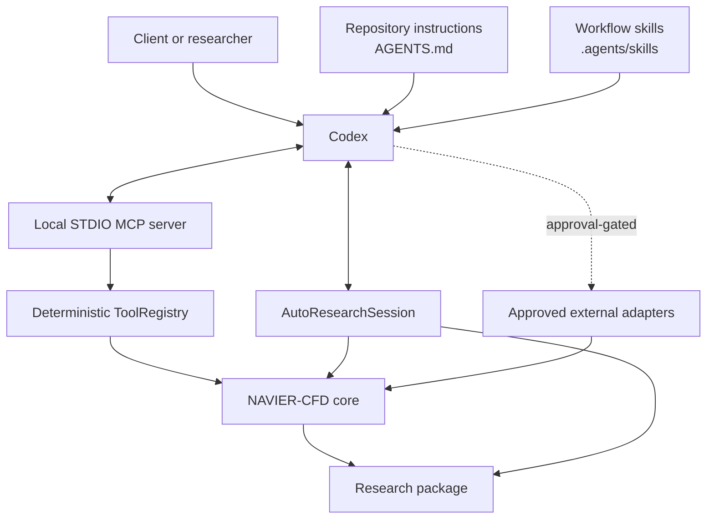
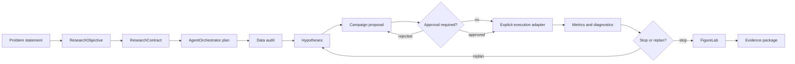
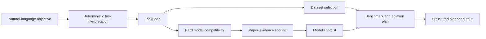
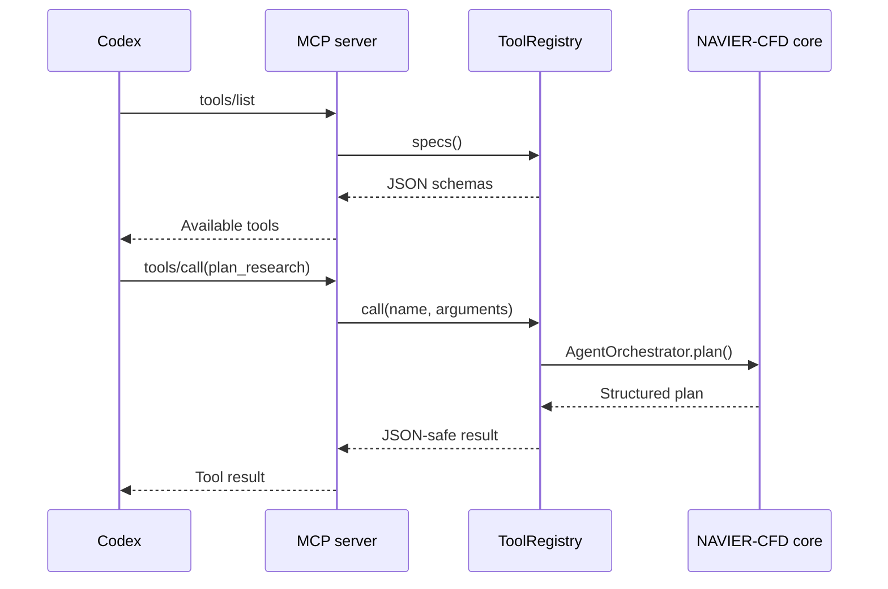
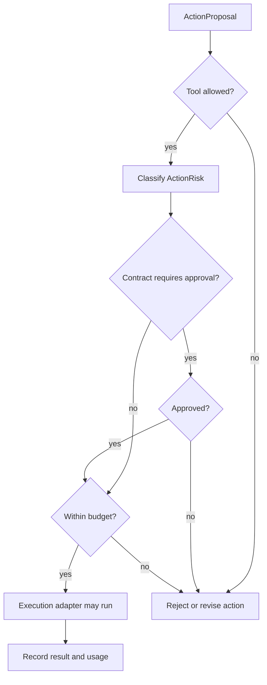
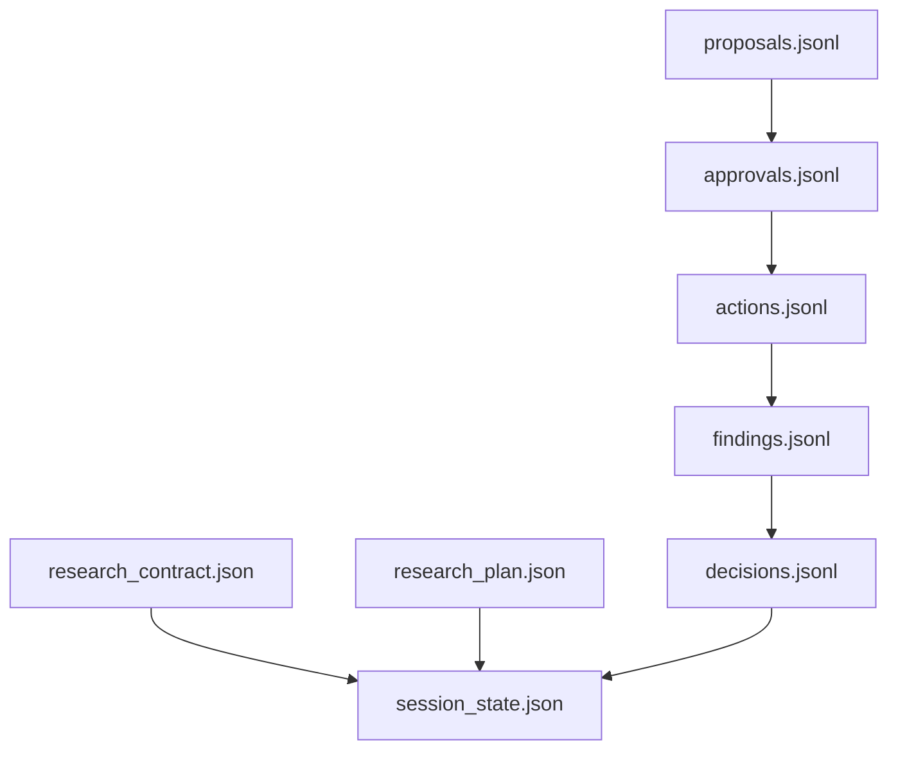
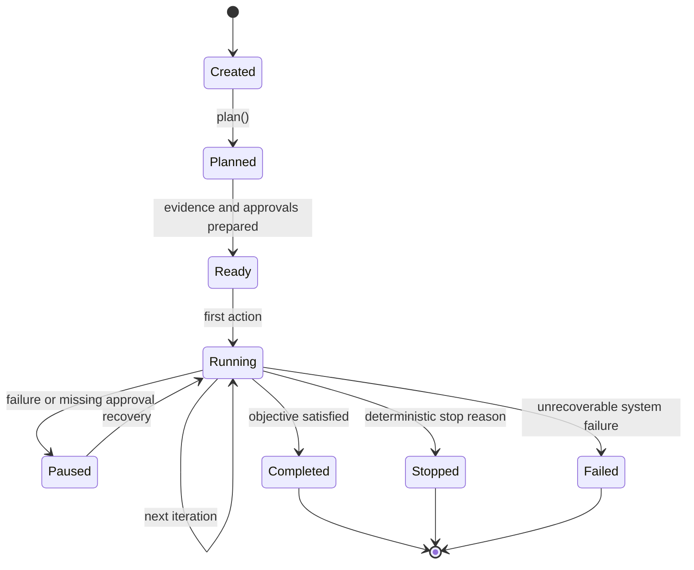
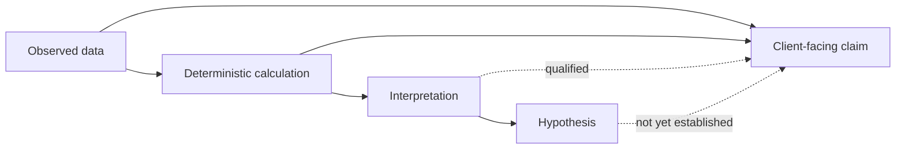

# AutoResearch architecture

NAVIER AutoResearch is an orchestration and governance layer around the existing NAVIER-CFD scientific stack. It does not replace datasets, models, training, metrics, or experiment manifests. It connects them to Codex through explicit skills and a controlled tool surface.

## System context

## Architectural layers

| Layer | Components | Responsibility |
|---|---|---|
| Interaction | Client, Codex | Interpret goals, present evidence, request approval. |
| Instruction | `AGENTS.md`, `.agents/skills` | Define scientific rules and reusable workflows. |
| Tool | MCP server, `ToolRegistry` | Expose explicit deterministic operations. |
| Governance | `ResearchContract`, `AutoResearchSession` | Enforce permissions, approvals, budgets, state, and stopping. |
| Scientific core | providers, `CFDSample`, model hub, recommender, trainer, metrics | Perform calculations and preserve scientific contracts. |
| Analysis | diagnostics and FigureLab | Localize errors, render figures, audit integrity. |
| Evidence | JSON/JSONL workspaces, checkpoints, manifests | Preserve provenance, actions, findings, and decisions. |
| Execution adapters | future training, solver, Slurm, storage connectors | Perform approved expensive or external actions. |

## Component flow

## Planning path

The existing `AgentOrchestrator` remains the planner.

An optional language model may improve extraction of the initial task fields, but deterministic schema validation and compatibility rules must remain authoritative.

## Tool-call path

The MCP server serializes results as JSON strings because the current tools return structured scientific metadata rather than binary data or interactive objects.

## Governance and approval path

### Action risk classes

| Risk | Examples | v1.1.0 expectation |
|---|---|---|
| `read` | list catalogues, inspect manifests, audit specifications | Normally automatic. |
| `write` | create configs, figures, reports, checkpoints | Approval by default. |
| `compute` | training, evaluation, large diagnostics | Approval by default. |
| `external` | downloads, remote APIs, cluster calls | Approval by default. |
| `destructive` | delete, overwrite, cancel permanent assets | Always tightly controlled. |

## Research memory

### File roles

| File | Role |
|---|---|
| `research_contract.json` | Immutable campaign intent, budget, permissions, and stop policy. |
| `research_plan.json` | Planner output, recommended models, dataset, metrics, and benchmark design. |
| `session_state.json` | Current status, iteration counters, and cumulative resource usage. |
| `proposals.jsonl` | Proposed tool actions with reason, risk, arguments, and estimated cost. |
| `approvals.jsonl` | Human or policy approval decisions. |
| `actions.jsonl` | Planning events and action results. |
| `findings.jsonl` | Evidence-linked observations, calculations, interpretations, and hypotheses. |
| `decisions.jsonl` | Iteration-level stop or continue decisions. |

JSONL is used for append-only event histories. It preserves failed attempts and avoids silently rewriting earlier research decisions.

## AutoResearch state machine

`AutoResearchSession.evaluate_iteration()` currently changes a newly active campaign to `running` or `stopped`. Execution adapters may set `ready`, `paused`, `completed`, or `failed` as the workflow matures.

## Scientific claim boundary

AutoResearch records four kinds of statements separately:

1. **Observed facts** — values or metadata directly present in the source.
2. **Computed results** — outputs of deterministic tools.
3. **Interpretations** — domain reasoning supported by observations and calculations.
4. **Hypotheses** — falsifiable explanations requiring further experiments.

A hypothesis must not be presented as a verified finding.

## Security boundary

The v1.1.0 server is read-only. It does not expose:

- arbitrary shell execution;
- Python `eval` or dynamic code execution;
- automatic package installation;
- solver execution;
- Slurm submission;
- large downloads;
- credential access;
- file overwrite or deletion.

Official dataset providers separately enforce host allowlists, transfer limits, checksums, and safe archive handling.

## Extension pattern

Future tools should be added in this order:

1. define a deterministic Python function;
2. define its inputs and outputs;
3. create analytical and failure-case tests;
4. register a `ToolSpec`;
5. assign an `ActionRisk`;
6. integrate it with `ResearchContract`;
7. add approval and budget checks;
8. expose it through MCP;
9. document the tool and skill workflow;
10. add provenance to every result.

Never expose a high-risk command directly through MCP before the governance layer can account for it.
