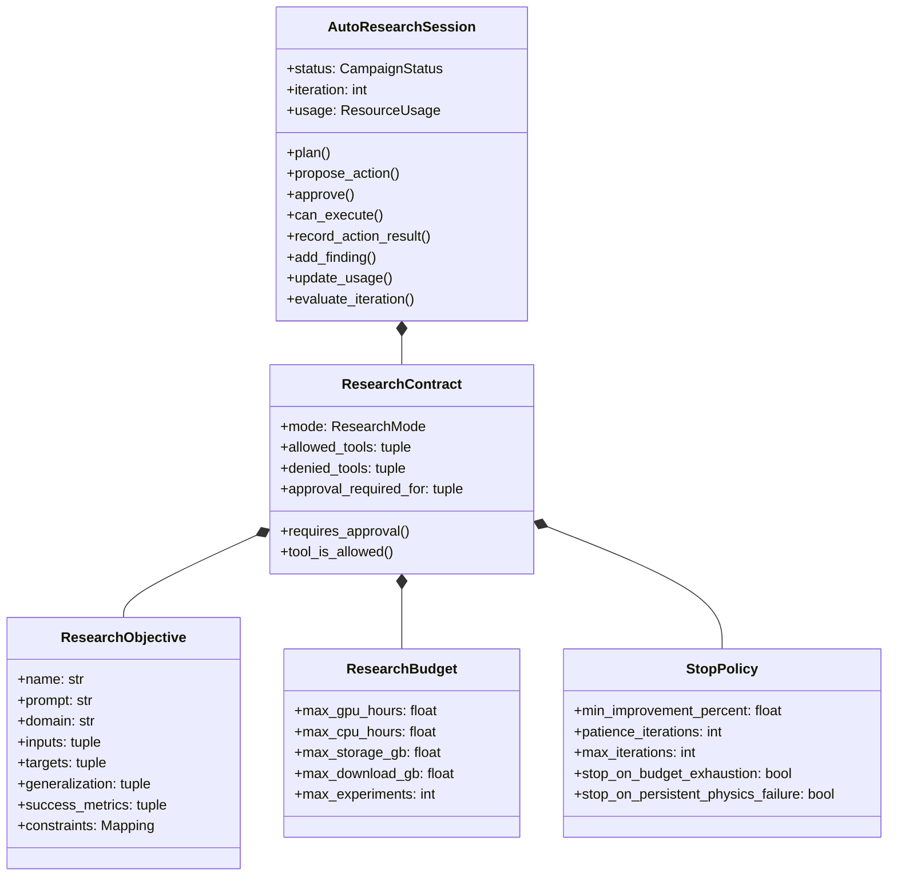
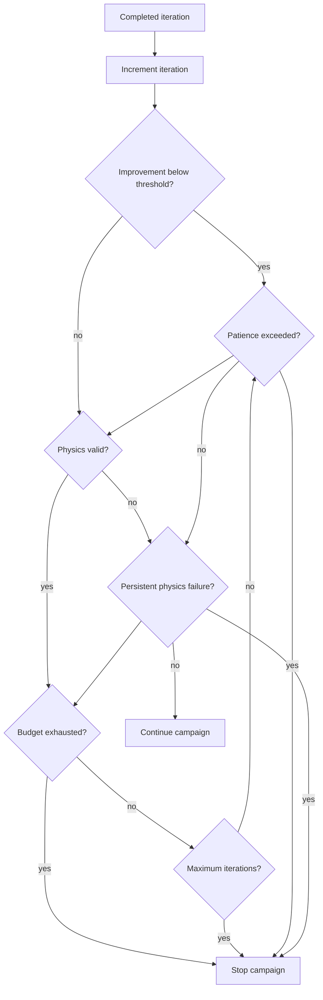
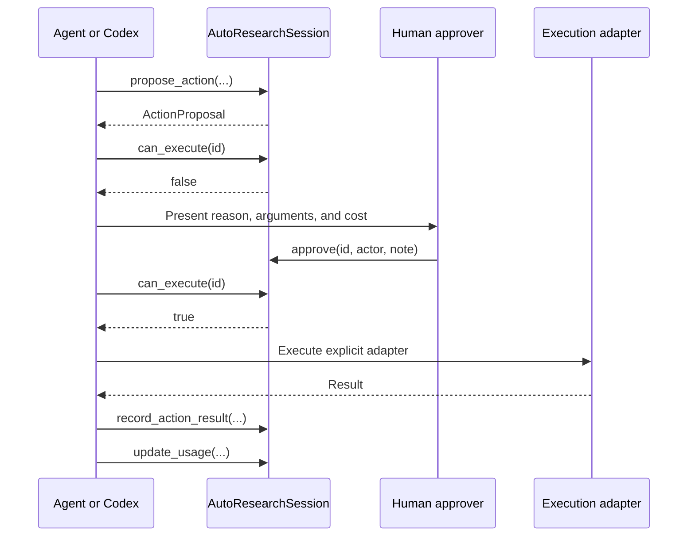
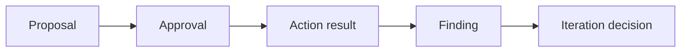

# Research contracts, sessions, approvals, and stopping

`ResearchContract` and `AutoResearchSession` are the governance foundation of NAVIER AutoResearch.

The contract defines what the campaign is allowed to do. The session records what the campaign actually proposes, receives approval for, executes through explicit adapters, finds, and decides.

## Object model



## `ResearchObjective`

The objective is the machine-readable scientific problem.

```python
from navier_cfd import ResearchObjective

objective = ResearchObjective(
    name="BubbleNet hidden velocity reconstruction",
    prompt="Reconstruct gas and solids velocities from EP_G history.",
    domain="gas_solid_multiphase",
    inputs=("gas_volume_fraction_history",),
    targets=("gas_velocity", "solids_velocity"),
    generalization=("unseen_superficial_gas_velocity", "late_time"),
    success_metrics=(
        "rmse_physical",
        "profile_cosine",
        "interface_rmse",
    ),
    constraints={
        "geometry": "fixed_rectangular_2d",
        "gpu_memory_gb": 12,
        "no_temporal_window_leakage": True,
    },
)
```

### Required design principles

- The prompt describes the scientific question, not a guaranteed result.
- Inputs and targets use explicit field semantics.
- Generalization defines the real test.
- Success metrics are measurable.
- Constraints separate confirmed facts from preferences.
- Missing metadata should be recorded outside the confirmed fields.

## `ResearchBudget`

Budgets are hard non-negative ceilings.

```python
from navier_cfd import ResearchBudget

budget = ResearchBudget(
    max_gpu_hours=24,
    max_cpu_hours=72,
    max_storage_gb=200,
    max_download_gb=20,
    max_experiments=12,
)
```

A zero value means no active limit for that resource in the current implementation. It does not grant unlimited organizational permission.

### Resource accounting

`AutoResearchSession.update_usage()` records cumulative increments:

```python
session.update_usage(
    gpu_hours=2.4,
    cpu_hours=1.0,
    storage_gb=3.2,
    downloaded_gb=0.0,
    experiments=1,
)
```

Negative increments are rejected.

## `StopPolicy`

```python
from navier_cfd import StopPolicy

policy = StopPolicy(
    min_improvement_percent=1.0,
    patience_iterations=3,
    max_iterations=10,
    stop_on_budget_exhaustion=True,
    stop_on_persistent_physics_failure=True,
)
```

### Stop logic



`evaluate_iteration()` can return these stop reasons:

- `budget_exhausted:<resources>`;
- `maximum_iterations_reached`;
- `insufficient_improvement`;
- `persistent_physics_failure`.

Multiple reasons can be recorded for one iteration.

## Research modes

### Assistant

```python
mode=ResearchMode.ASSISTANT
```

All non-read actions require approval.

Use for:

- first-time clients;
- private data;
- expensive solvers;
- uncertain field semantics;
- destructive or irreversible workflows.

### Guided

```python
mode=ResearchMode.GUIDED
```

Read actions may proceed automatically. Write, compute, external, and destructive risks require approval by default.

Use for most laboratory campaigns.

### Bounded

```python
mode=ResearchMode.BOUNDED
```

The session may act within:

- an explicit tool allowlist;
- denied-tool restrictions;
- resource ceilings;
- stop policies;
- any remaining risk approvals.

Bounded mode is not unrestricted autonomy.

## Tool permissions

```python
contract = ResearchContract(
    objective=objective,
    budget=budget,
    stop_policy=policy,
    mode=ResearchMode.BOUNDED,
    allowed_tools=(
        "navier.inspect_dataset",
        "navier.calculate_metrics",
        "navier.render_figure",
    ),
    denied_tools=(
        "navier.delete_run",
        "navier.overwrite_checkpoint",
    ),
)
```

A tool cannot be both allowed and denied.

`tool_is_allowed()` follows:

1. denied tools are always blocked;
2. if the allowlist is empty, tools not denied are eligible;
3. if the allowlist is non-empty, only listed tools are eligible.

Eligibility is separate from approval.

## Action proposals

```python
proposal = session.propose_action(
    name="Evaluate checkpoint on strict vgas holdout",
    tool="navier.evaluate_checkpoint",
    arguments={
        "checkpoint": "runs/bubblenet/checkpoint-best",
        "split": "test_vgas_holdout",
    },
    risk=ActionRisk.COMPUTE,
    reason="Measure unseen-operating-condition performance",
    estimated_cost={"gpu_hours": 0.2},
)
```

An `ActionProposal` records:

- unique identifier;
- descriptive name;
- tool;
- arguments;
- risk;
- scientific reason;
- estimated resource cost;
- approval requirement;
- creation time.

## Approval flow



Approval does not execute the action. It only changes whether an external executor is permitted to proceed.

## Findings

```python
session.add_finding(
    kind="computed_result",
    statement="Interface RMSE is 2.8 times bulk RMSE.",
    evidence=(
        "diagnostics/interface_error.json",
        "figures/interface_error.pdf",
    ),
    confidence="high",
)
```

Recommended finding kinds:

- `observed_fact`;
- `computed_result`;
- `interpretation`;
- `hypothesis`;
- `risk`;
- `negative_result`;
- `reproducibility_note`.

The API accepts any string, but consistent categories improve downstream auditing.

## Session workspace

```text
workspace/
├── research_contract.json
├── research_plan.json
├── session_state.json
├── proposals.jsonl
├── approvals.jsonl
├── actions.jsonl
├── findings.jsonl
└── decisions.jsonl
```

### Append-only reasoning trail



Failed actions remain in the record. This prevents survivorship bias in automated campaigns.

## Creating and loading contracts

Save:

```python
contract.save("runs/project/research_contract.json")
```

Load:

```python
from navier_cfd import ResearchContract

contract = ResearchContract.load(
    "runs/project/research_contract.json"
)
```

Create an objective from a prompt:

```python
from navier_cfd import objective_from_prompt

objective = objective_from_prompt(
    "Forecast temperature and pressure in unseen reactor geometries",
    name="Reactor geometry-transfer campaign",
    domain="reactive_transport",
    inputs=("geometry", "inlet_conditions"),
    targets=("temperature", "pressure"),
    generalization=("unseen_geometry",),
)
```

## Session API example

```python
from navier_cfd import (
    ActionRisk,
    AutoResearchSession,
    ResearchBudget,
    ResearchMode,
    StopPolicy,
)

session = AutoResearchSession.create(
    "runs/reactor-project",
    "Forecast temperature and pressure in unseen reactor geometries",
    name="Reactor geometry-transfer campaign",
    domain="reactive_transport",
    mode=ResearchMode.GUIDED,
    budget=ResearchBudget(max_gpu_hours=20, max_experiments=8),
    stop_policy=StopPolicy(max_iterations=8),
    inputs=("geometry", "inlet_conditions"),
    targets=("temperature", "pressure"),
    generalization=("unseen_geometry",),
)

plan = session.plan()
print(session.summary())

proposal = session.propose_action(
    name="Run FNO baseline",
    tool="navier.train_model",
    risk=ActionRisk.COMPUTE,
    reason="Establish a common structured baseline",
    estimated_cost={"gpu_hours": 1.5},
)

session.approve(
    proposal.id,
    approved=True,
    actor="project_owner",
)

# An explicit executor performs the run here.
session.record_action_result(
    proposal.id,
    success=True,
    result={"manifest": "runs/fno/run_manifest.json"},
)
session.update_usage(gpu_hours=1.4, experiments=1)

decision = session.evaluate_iteration(
    improvement_percent=2.3,
    physics_valid=True,
)
```

## Current persistence limitation

v1.1.0 persists files but does not yet implement a `load_session()` constructor that restores in-memory proposal and approval dictionaries from JSONL. A host should maintain the active process or reconstruct state explicitly. Persistent rehydration is a suitable follow-up feature.

## Safety notes

- Do not place credentials in contracts or action arguments.
- Do not use approval notes as a substitute for institutional access control.
- Budget checks occur when evaluating campaign state; execution adapters should also preflight estimated cost.
- A successful action result does not imply a scientifically valid result.
- A physics failure should be recorded even when the numerical metric improves.
