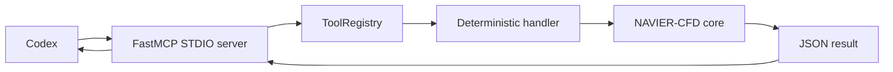
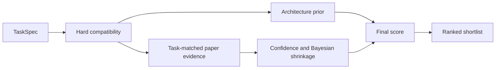

# AutoResearch MCP tools

NAVIER-CFD 1.1.0 exposes a deliberately small read-only MCP surface for Codex. The same tool definitions are available through the Python `ToolRegistry` and the `navier-autoresearch tools` command.

## Start the server

```bash
pip install "navier-cfd[autoresearch]"
navier-autoresearch mcp
```

Project configuration:

```toml
[mcp_servers.navier_cfd]
command = "navier-autoresearch"
args = ["mcp"]
```

Use the repository example as the source of truth:

```bash
cp .codex/config.toml.example .codex/config.toml
```

## Tool architecture



Each tool has:

- a stable name;
- a human-readable description;
- a JSON input schema;
- a `readOnlyHint`;
- a deterministic handler;
- JSON-serializable output.

## Tool summary

| Tool | Required input | Main output | Side effects |
|---|---|---|---|
| `list_datasets` | none | Dataset catalogue records | none |
| `list_models` | none | Model catalogue records | none |
| `plan_research` | `prompt` | Interpreted task and benchmark plan | none |
| `recommend_models` | `task` | Ranked compatible model records | none |
| `list_metric_suites` | none | Suites and metric identifiers | none |
| `audit_figure_spec` | `spec` | Figure-integrity report | none |

## `list_datasets`

Lists registered CFD and PDE dataset families.

### Input

```json
{}
```

### Output

A JSON array of dataset catalogue records. Fields depend on `DatasetSpec`, and may include:

- identifier and display name;
- representation;
- dimensionality;
- temporal characteristics;
- geometry behavior;
- physics;
- access metadata;
- supported task families;
- limitations.

### Intended use

Use before selecting a dataset or claiming that NAVIER-CFD supports a representation.

### Python

```python
from navier_cfd import ToolRegistry

datasets = ToolRegistry().call("list_datasets")
```

### Codex guidance

Do not interpret catalogue registration as evidence that the full upstream collection is locally downloaded. Use the provider and staging documentation for access status.

## `list_models`

Lists registered surrogate-model families and compatibility metadata.

### Input

```json
{}
```

### Output

A JSON array of model records, which may include:

- model identifier;
- categories and tasks;
- dimensions;
- mesh and geometry support;
- temporal modes;
- physics tags;
- integration status;
- minimum-memory guidance;
- references and limitations.

### Intended use

Use to inspect the model space before filtering or recommending.

### Important limitation

A registered NAVIER-CFD reference implementation is not automatically a numerically identical reproduction of an author’s private code, checkpoint, preprocessing, or paper table.

## `plan_research`

Converts a client problem into the deterministic `AgentOrchestrator` plan.

### Input schema

```json
{
  "prompt": "Benchmark unstructured 3D vehicle drag surrogates with geometry holdout"
}
```

`prompt` must be a non-empty string.

### Output structure

The exact planner output evolves with `AgentPlan`, but includes:

- interpreted `TaskSpec`;
- selected dataset;
- recommended models;
- benchmark design;
- metrics and ablations;
- reasoning and cautions.

### Example

```python
from navier_cfd import ToolRegistry

plan = ToolRegistry().call(
    "plan_research",
    {
        "prompt": (
            "Reconstruct gas and solids velocity fields from gas-volume-fraction "
            "history with unseen superficial-gas-velocity holdout"
        )
    },
)
```

### Correct use

- Treat the result as a research proposal.
- Confirm inferred fields, units, geometry, solver, and split definitions against real data.
- Run the data-audit skill before compute.
- Record missing metadata as unresolved, not as assumptions silently converted to facts.

### Failure behavior

An empty prompt raises `ValueError("prompt is required")`.

## `recommend_models`

Ranks compatible models using hard task compatibility and paper-evidence scoring.

### Input schema

```json
{
  "task": {
    "problem": "vehicle_drag",
    "task_type": "surrogate",
    "dimension": 3,
    "mesh_type": "point_cloud",
    "temporal_mode": "steady",
    "geometry_mode": "varying",
    "physics": ["aerodynamics"],
    "fidelity": "rans",
    "hardware_memory_gb": 24,
    "requires_geometry_transfer": true
  },
  "top_k": 5,
  "evidence_weight": 0.7
}
```

### Parameters

| Parameter | Meaning |
|---|---|
| `task` | Keyword arguments for `TaskSpec`. Required. |
| `top_k` | Number of ranked compatible models. Default: 8. |
| `evidence_weight` | Weight assigned to evidence score. Range: 0–1. Default: 0.70. |

JSON arrays in `physics` are converted to tuples before `TaskSpec` construction.

### Output

A JSON array of recommendation records containing:

- model metadata;
- final score;
- architecture compatibility score;
- evidence score;
- evidence confidence;
- evidence coverage;
- matched evidence count;
- reasons;
- cautions;
- evidence details.

### Ranking flow



### Interpretation rules

- Incompatible dimensions, meshes, required geometry transfer, required mesh transfer, or memory limits can remove a model.
- Missing evidence shrinks toward a neutral prior; it is not treated as proof of poor performance.
- Low coverage or confidence must remain visible.
- Recommendation is not a performance guarantee.

### Failure behavior

A missing or empty `task` raises `ValueError("task is required")`. Invalid `TaskSpec` fields raise normal Python validation errors.

## `list_metric_suites`

Lists registered metric suites and metric identifiers.

### Input

```json
{}
```

### Output

```json
{
  "suites": {
    "data_standard": ["mse", "rmse", "..."],
    "fluid_standard": ["rmse", "relative_l2", "..."]
  },
  "metrics": ["binned_spectral_mse", "cosine_similarity", "..."]
}
```

### Intended use

Use this tool to discover metric names. Metric validity still depends on `MetricContext` and physical metadata.

A metric name in the catalogue does not mean it is valid for every dataset.

Examples:

- divergence requires velocity channels and meaningful spatial derivatives;
- turbulent kinetic energy requires velocity channels and a time axis;
- profile metrics require a declared profile axis;
- physical evaluation should normally occur after inverse normalization.

## `audit_figure_spec`

Audits a `FigureSpec` before rendering.

### Input schema

```json
{
  "spec": {
    "figure_type": "truth_prediction_error",
    "fields": ["gas_velocity_y"],
    "units": "m/s",
    "shared_color_limits": true,
    "error_definition": "absolute",
    "mask": "fluid_cells",
    "output_formats": ["pdf", "svg", "png"],
    "dpi": 400,
    "metadata": {
      "normalized": false,
      "interpolation": "none",
      "selection_rule": "worst, median, and representative cases"
    }
  }
}
```

### Output

```json
{
  "valid": true,
  "issues": []
}
```

Issues contain:

- `code`;
- `severity`;
- `message`.

### Current audit rules

| Code | Severity | Trigger |
|---|---|---|
| `missing_units` | error | Physical field figure has no units. |
| `unshared_truth_prediction_scale` | error | Truth and prediction use separate scales. |
| `normalized_data_physical_label` | error | Normalized data are labeled with physical units. |
| `mask_not_declared` | warning | Field/error plot does not declare invalid-region handling. |
| `cherry_picked_cases` | error | Metadata explicitly identify cherry-picking. |
| `visual_smoothing` | warning | Interpolation can smooth errors. |
| `low_raster_resolution` | warning | PNG output is below 300 dpi. |
| `no_vector_output` | warning | Neither PDF nor SVG is requested. |

The report is valid only when no `error` issue exists.

## CLI inspection

List schemas without launching an MCP client:

```bash
navier-autoresearch tools
```

Generate a plan directly:

```bash
navier-autoresearch plan \
  "Forecast a 2D cylinder wake across unseen Reynolds numbers" \
  --output runs/cylinder-plan.json
```

## Direct Python use

```python
from navier_cfd import ToolRegistry

registry = ToolRegistry()

for spec in registry.specs():
    print(spec.name, spec.read_only)

result = registry.call("list_metric_suites")
```

## Registering a new tool

```python
from navier_cfd import ToolRegistry, ToolSpec

registry = ToolRegistry()

spec = ToolSpec(
    name="inspect_run_manifest",
    description="Read and summarize a NAVIER-CFD run manifest.",
    input_schema={
        "type": "object",
        "properties": {"path": {"type": "string"}},
        "required": ["path"],
        "additionalProperties": False,
    },
    read_only=True,
)

def inspect(arguments):
    path = arguments["path"]
    # Parse using a deterministic, validated implementation.
    return {"path": path}

registry.register(spec, inspect)
```

Before exposing a new tool through MCP:

1. validate all inputs;
2. avoid arbitrary code execution;
3. assign the correct risk class;
4. create analytical and failure tests;
5. ensure JSON-safe output;
6. record provenance;
7. document assumptions;
8. add approval and budget enforcement for any non-read operation.

## Planned future tool groups

Future versions may add approval-gated groups for:

- dataset inspection and staging;
- run-manifest inspection;
- metric calculation;
- checkpoint evaluation;
- figure rendering;
- baseline training;
- Slurm submission;
- OpenFOAM, MFiX, and DEM execution.

These are roadmap items, not v1.1.0 capabilities.
