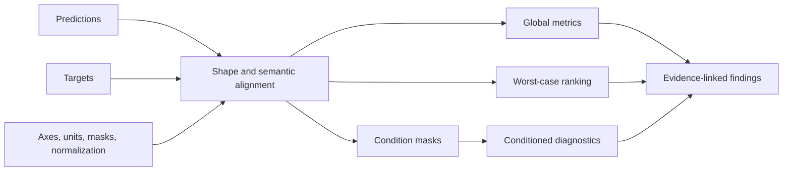
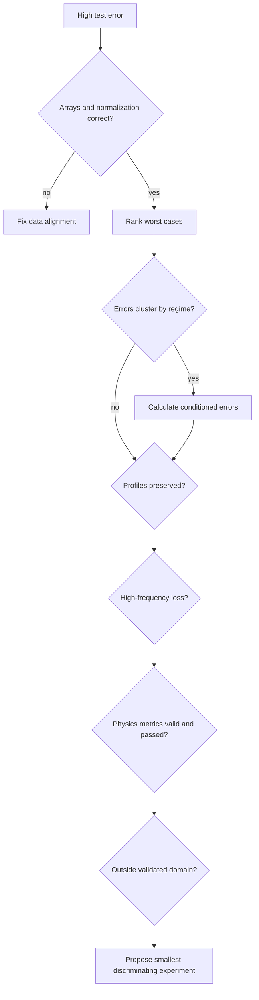

# Deterministic CFD diagnostics

NAVIER-CFD 1.1.0 introduces a focused diagnostic foundation for field summaries, conditioned errors, multiphase interface analysis, and worst-case ranking.

These functions are deterministic NumPy operations. They do not rely on language-model numerical reasoning.

## Available functions

| Function | Purpose |
|---|---|
| `field_summary` | Summarize finite values, optionally within a mask. |
| `conditioned_rmse` | Compute RMSE inside a declared condition mask. |
| `gradient_interface_mask` | Create a high-gradient phase-fraction diagnostic mask. |
| `analyze_interface_error` | Compare interface and bulk errors. |
| `rank_worst_cases` | Rank cases by RMSE and report MAE and maximum error. |

## Diagnostic workflow



Always verify:

- prediction and target shapes;
- case, time, spatial, and channel axes;
- physical units and inverse normalization;
- validity masks;
- geometry correspondence;
- field mapping.

## `field_summary`

```python
import numpy as np
from navier_cfd import field_summary

report = field_summary(
    velocity_y,
    mask=fluid_cells,
)
```

Output:

```json
{
  "count": 18540,
  "finite_fraction": 1.0,
  "min": -0.82,
  "max": 1.47,
  "mean": 0.13,
  "std": 0.32,
  "rms": 0.35
}
```

### Semantics

- `finite_fraction` is calculated over the full input array.
- Summary statistics use finite values remaining after mask application.
- A mask is broadcast over trailing dimensions.
- Empty finite selection raises a `ValueError`.

### Uses

- detect non-finite values;
- identify impossible ranges;
- compare field scales;
- check inverse normalization;
- report target and prediction distributions.

## `conditioned_rmse`

```python
from navier_cfd import conditioned_rmse

boundary_rmse = conditioned_rmse(
    prediction,
    target,
    boundary_mask,
)
```

The function:

1. verifies matching prediction and target shapes;
2. broadcasts the condition mask;
3. combines it with finite-value masks;
4. calculates RMSE only on selected values.

Use it for:

- boundary regions;
- bubble interfaces;
- high-vorticity cells;
- late-time windows;
- specified operating regimes;
- sensor neighborhoods;
- uncertainty quantiles.

The scientific validity depends on how the mask was defined.

## `gradient_interface_mask`

```python
from navier_cfd import gradient_interface_mask

interface_mask = gradient_interface_mask(
    gas_volume_fraction,
    percentile=85.0,
    spatial_axes=(1, 2),
)
```

The function calculates gradients along the declared spatial axes, forms a gradient magnitude, and selects positive finite values at or above the chosen percentile.


### Important interpretation

The result is a **high-gradient diagnostic proxy**, not a guaranteed physical interface classifier.

Its meaning depends on:

- grid spacing;
- smoothing and numerical diffusion;
- selected spatial axes;
- percentile;
- phase-fraction noise;
- temporal alignment;
- geometry masks.

For nonuniform grids, derivative-aware methods using physical coordinates should be preferred in future versions.

### Failure cases

- percentile outside 0–100;
- all gradients equal to zero;
- incorrect axes;
- inclusion of time or channel axes as spatial axes.

## `analyze_interface_error`

```python
from navier_cfd import analyze_interface_error

report = analyze_interface_error(
    prediction,
    target,
    gas_volume_fraction,
    percentile=85.0,
    spatial_axes=(1, 2),
)
```

Output fields:

| Field | Meaning |
|---|---|
| `interface_percentile` | Percentile used to construct the mask. |
| `interface_fraction` | Fraction of phase-fraction array selected. |
| `interface_rmse` | RMSE within interface-mask cells. |
| `bulk_rmse` | RMSE outside the interface mask. |
| `interface_to_bulk_rmse_ratio` | Interface RMSE divided by bulk RMSE. |
| `interface_squared_error_fraction` | Fraction of total squared error localized in the interface mask. |

### Interpretation example

```text
interface_fraction = 0.15
interface_squared_error_fraction = 0.62
interface_to_bulk_rmse_ratio = 2.4
```

This means 15% of the phase-fraction locations contain 62% of the squared error, and RMSE in that region is 2.4 times the bulk RMSE.

It does not prove the model fails because of a particular physical mechanism. It provides evidence for an interface-error hypothesis.

## `rank_worst_cases`

```python
from navier_cfd import rank_worst_cases

rows = rank_worst_cases(
    predictions,
    targets,
    case_ids=("vgas_070", "vgas_098", "vgas_139"),
    mask=fluid_cells,
    top_k=3,
)

for row in rows:
    print(row.case_id, row.rmse, row.mae, row.max_abs_error)
```

The first axis is interpreted as the case axis.

Each `CaseError` contains:

- `case_id`;
- `rmse`;
- `mae`;
- `max_abs_error`.

Cases with no finite selected values are skipped.

### Mask behavior

A mask matching the full prediction shape is indexed per case. Otherwise it is broadcast to each case.

Be explicit about whether the mask is:

- common geometry;
- per-case geometry;
- per-time validity;
- per-channel validity.

## BubbleNet example

```python
import numpy as np
from navier_cfd import (
    analyze_interface_error,
    field_summary,
    rank_worst_cases,
)

pred = np.load("pred_u_g_y.npy")
true = np.load("true_u_g_y.npy")
alpha_g = np.load("ep_g.npy")
case_ids = np.load("case_ids.npy").astype(str)

print("Target:", field_summary(true))
print("Prediction:", field_summary(pred))

worst = rank_worst_cases(
    pred,
    true,
    case_ids=case_ids,
    top_k=5,
)

interface = analyze_interface_error(
    pred,
    true,
    alpha_g,
    percentile=85,
    spatial_axes=(1, 2),
)
```

A suitable finding would be:

> “The five largest-RMSE cases occur at the two highest held-out gas velocities. A gradient-derived mask covering 15% of the domain contains 62% of total squared error.”

A stronger causal statement requires additional experiments.

## Diagnostic decision tree



## Relationship to metric suites

The diagnostic functions complement, rather than replace, NAVIER-CFD metric suites.

Use metric suites for standardized comparisons:

- `data_standard`;
- `the_well`;
- `realpdebench`;
- `fluid_standard`.

Use diagnostics to localize and explain performance:

- worst cases;
- selected regions;
- interfaces;
- regimes;
- boundaries;
- time windows.

## Current limitations

v1.1.0 does not yet include deterministic functions for:

- arbitrary nonuniform-grid derivatives;
- vortex-core detection;
- boundary-layer thickness;
- shock detection;
- particle-cluster statistics;
- spectral conditioned errors;
- uncertainty calibration;
- automatic regime classification;
- connected-component bubble tracking.

These are planned extensions and should not be implied by the current API.
