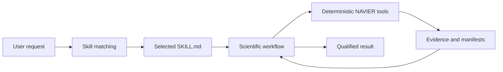
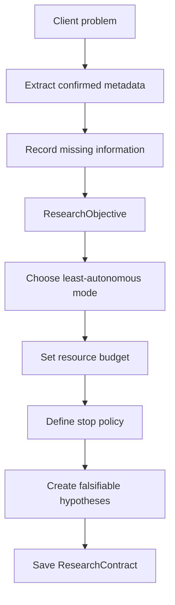
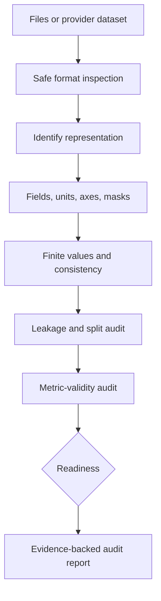
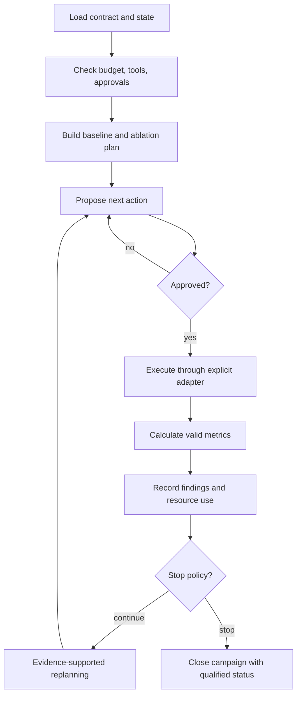
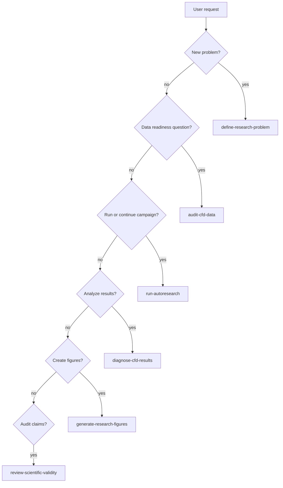

# Codex skills for NAVIER-CFD

Repository skills teach Codex how to perform multi-step scientific workflows using NAVIER-CFD. They live under `.agents/skills/<skill-name>/SKILL.md`.

A skill is not an executable solver or metric. It is an instruction package that selects tools, defines ordering, preserves scientific constraints, and specifies the expected outputs.

## Skill and tool relationship

## Included skills

| Skill | Trigger examples | Primary output |
|---|---|---|
| `navier-define-research-problem` | “Start a project”, “define the surrogate task” | Research objective and contract |
| `navier-audit-cfd-data` | “Check these MFiX files”, “is the dataset consistent?” | Readiness and leakage audit |
| `navier-run-autoresearch` | “Run bounded AutoResearch”, “continue the campaign” | Controlled iterative campaign |
| `navier-diagnose-cfd-results` | “Why did the model fail?”, “where is error concentrated?” | Evidence-linked diagnostics |
| `navier-generate-research-figures` | “Make paper-quality CFD plots” | Audited figures and manifests |
| `navier-review-scientific-validity` | “Review the results critically” | Claim and reproducibility audit |

## `navier-define-research-problem`

### Purpose

Convert an informal client problem into a machine-readable scientific contract.

### Use when

- a client introduces a new CFD or chemical-engineering problem;
- the objective, inputs, targets, or generalization test are not formalized;
- a new AutoResearch workspace is being created;
- compute and approval boundaries must be agreed.

### Workflow

### Required reasoning

Identify:

- physical system;
- input and target quantities;
- geometry and mesh;
- temporal mode;
- solver or experimental source;
- phases, species, and governing phenomena;
- operating variables;
- intended generalization;
- success metrics;
- compute and storage limits;
- missing metadata.

### Outputs

- `ResearchObjective`;
- `ResearchContract`;
- initial hypotheses;
- unresolved-question list;
- proposed data-audit plan.

### Prohibited behavior

Do not promise feasibility before data audit and baselines.

## `navier-audit-cfd-data`

### Purpose

Determine whether CFD, PDE, MFiX, DEM, mesh, particle, or experimental data are usable for surrogate modelling.

### Use when

- onboarding new files;
- reviewing fields, units, coordinates, masks, geometry, or time windows;
- detecting leakage;
- deciding which physics metrics are valid.

### Workflow

### Audit checklist

- supported and safe file formats;
- array and mesh shapes;
- coordinates and connectivity;
- field names and phase/species semantics;
- units and normalization;
- temporal cadence and window construction;
- geometry identifiers;
- operating conditions;
- solver and fidelity;
- NaN, Inf, constants, duplicates, impossible ranges;
- official split preservation;
- temporal, geometry, seed, and derived-sample leakage;
- missing requirements for physics metrics.

### Readiness classes

- **ready** — sufficient metadata and no blocking consistency problem;
- **conditionally ready** — usable after named corrections;
- **not ready** — evidence is insufficient or data integrity is blocking.

### Prohibited behavior

Do not infer units or semantics from filenames alone.

## `navier-run-autoresearch`

### Purpose

Run or continue an iterative campaign inside a `ResearchContract`.

### Preconditions

- a saved contract;
- completed data audit;
- current session state;
- known remaining budget;
- explicit tool permissions;
- hypotheses and success criteria.

### Workflow

### Allowed conclusions

- goal achieved;
- additional data required;
- no tested method satisfies validity;
- hypothesis rejected;
- budget exhausted;
- user-stopped campaign;
- unrecoverable workflow failure.

### Prohibited behavior

- bypassing approvals;
- arbitrary hyperparameter sweeps;
- hiding failed runs;
- continuing after stop criteria;
- treating a negative result as a system failure.

## `navier-diagnose-cfd-results`

### Purpose

Explain where and why a simulation or surrogate result fails using deterministic calculations.

### Workflow

1. read the run manifest and provenance;
2. verify array alignment;
3. inverse-transform data when required;
4. calculate general field metrics;
5. check physics-metric assumptions;
6. rank worst cases;
7. condition errors by regime, time, geometry, or phase;
8. inspect profiles, spectra, conservation, boundaries, stability, and uncertainty where valid;
9. distinguish observations, calculations, interpretation, and hypotheses;
10. propose the smallest discriminating next experiment.

### Failure taxonomy

| Pattern | Typical evidence |
|---|---|
| Global bias | shifted mean and broad residual distribution |
| Profile collapse | high profile similarity failure despite smooth fields |
| High-frequency loss | spectral deficit at high wavenumber |
| Boundary error | conditioned error near boundaries |
| Interface error | high interface-to-bulk RMSE ratio |
| Temporal drift | error growth or energy drift with rollout horizon |
| OOD behavior | failure clustered outside training support |
| Miscalibration | uncertainty not associated with error |

The current v1.1.0 deterministic diagnostic functions are described in [CFD diagnostics](CFD_DIAGNOSTICS.md).

### Prohibited behavior

Low RMSE alone is not proof of physical validity.

## `navier-generate-research-figures`

### Purpose

Design, render, and audit publication-grade CFD figures.

### Workflow

### Required declarations

- field and units;
- normalization state;
- mask;
- cases and times;
- selection rule;
- shared color limits;
- error definition and limits;
- interpolation;
- coordinates and aspect ratio;
- output formats and DPI.

### Prohibited behavior

- truth and prediction with incomparable color scales;
- normalized values labeled as physical values;
- hidden clipping or smoothing;
- favorable-case selection without a declared rule;
- inclusion of invalid or padded cells;
- decorative plots that do not answer a scientific question.

See [NAVIER FigureLab](FIGURELAB.md).

## `navier-review-scientific-validity`

### Purpose

Act as a skeptical reviewer of a completed or ongoing campaign.

### Review areas

- alignment between objective and final claim;
- data provenance and exclusions;
- split leakage and generalization definition;
- baseline relevance;
- equal or disclosed budgets;
- metric definitions and validity;
- aggregation and confidence intervals;
- physics validity and stability;
- uncertainty and OOD handling;
- case and figure selection;
- failed runs and negative findings;
- reproducibility and hashes;
- claim strength.

### Claim classifications

- **supported**
- **partially supported**
- **unsupported**
- **outside scope**

### Output

A prioritized corrective-action list ordered by scientific importance.

### Prohibited behavior

Do not strengthen wording beyond the evidence.

## Selecting a skill

More than one skill may be used in a campaign, but they should be invoked in a scientifically sensible order.

## Skill development rules

A new skill should:

1. have a narrow and explicit description;
2. state positive and negative triggers;
3. define required inputs;
4. define ordered workflow steps;
5. identify deterministic tools;
6. specify outputs and workspace artifacts;
7. state scientific failure modes;
8. state prohibited behavior;
9. avoid hiding expensive execution inside instructions;
10. be tested with representative prompts.
