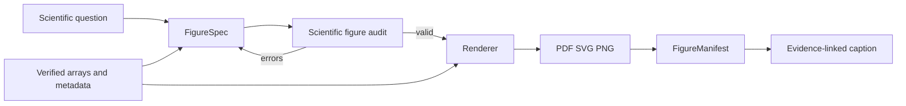
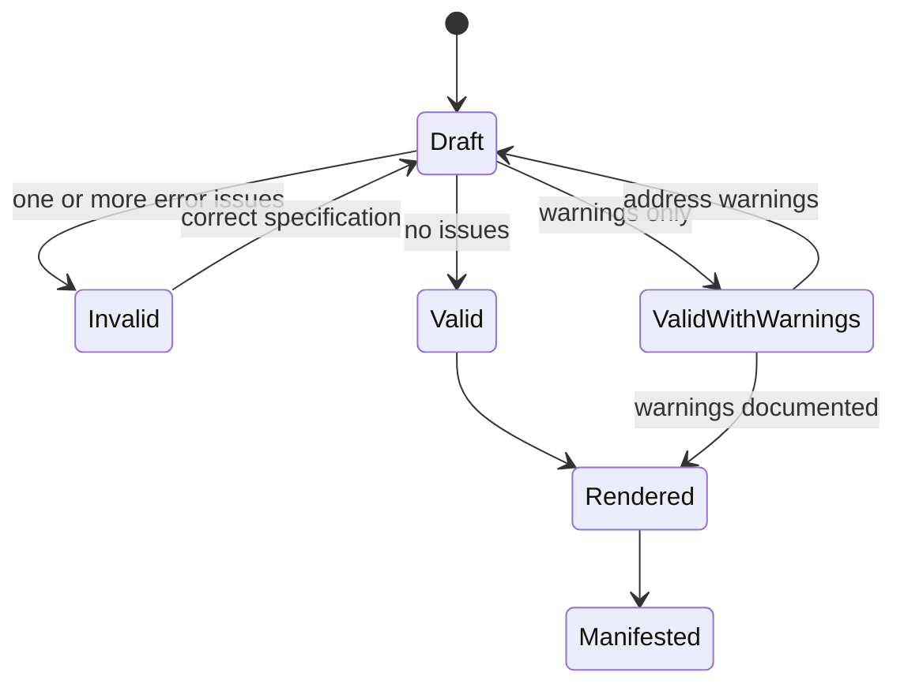
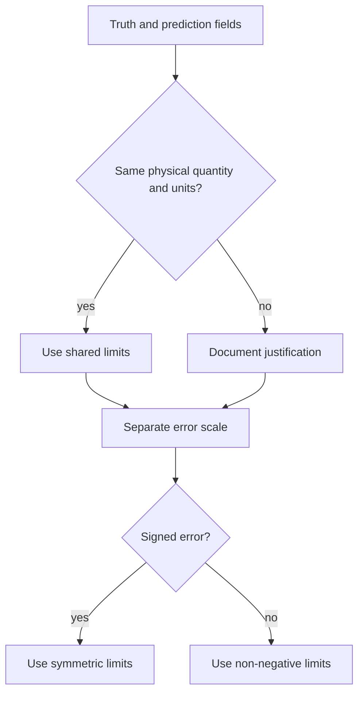

# NAVIER FigureLab

NAVIER FigureLab provides reproducible specifications, scientific-integrity auditing, optional Matplotlib rendering, and traceability manifests for CFD and surrogate-model figures.

The design rule is:

> **A figure is a scientific result with provenance, not a decorative image.**

## Figure workflow



## `FigureSpec`

```python
from navier_cfd import FigureSpec

spec = FigureSpec(
    figure_type="truth_prediction_error",
    fields=("gas_velocity_y",),
    title="Held-out gas velocity at t = 1.60 s",
    cases=("vgas_139",),
    times=(1.60,),
    units="m/s",
    shared_color_limits=True,
    color_limits=(-1.2, 1.2),
    error_limits=(0.0, 0.8),
    error_definition="absolute",
    mask="fluid_cells",
    output_formats=("pdf", "svg", "png"),
    style="nature_clean",
    dpi=400,
    metadata={
        "normalized": False,
        "interpolation": "none",
        "selection_rule": "worst held-out case by physical RMSE",
    },
)
```

### Supported figure types

| Type | Intended use | Renderer in v1.1.0 |
|---|---|---|
| `truth_prediction_error` | Field truth, prediction, and error | yes |
| `profile` | Mean or sectional profiles | yes |
| `rollout` | Error or physical quantity versus horizon | specification only |
| `spectrum` | Energy or Fourier-error spectrum | specification only |
| `parity` | Predicted versus target quantities | specification only |
| `ablation` | Model or feature comparison | specification only |
| `interface_error` | Multiphase interface diagnostics | specification only |

The schema accepts all listed types, but only field comparison and profile rendering are implemented in v1.1.0.

### Error definitions

- `signed`
- `absolute`
- `squared`
- `relative`

For relative error, the renderer currently divides by `max(abs(truth), machine epsilon)`. This can produce visually extreme values near zero and should be used with explicit limits and scientific justification.

### Output formats

- PDF
- SVG
- PNG

DPI applies to PNG.

## Figure audit

```python
from navier_cfd import audit_figure_spec

report = audit_figure_spec(spec)

for issue in report.issues:
    print(issue.severity, issue.code, issue.message)
```

### Audit state flow



### Current rules

| Rule | Why it matters |
|---|---|
| Physical field figures require units. | Prevents ambiguous or normalized quantities being presented as physical. |
| Truth and prediction share color limits. | Prevents apparent similarity caused by separate rescaling. |
| Normalized data cannot carry physical labels. | Prevents unit misrepresentation. |
| Masks should be declared. | Prevents obstacles, padding, or invalid cells being treated as valid zeros. |
| Cherry-picked cases are rejected. | Prevents favorable-example bias. |
| Smoothing is warned. | Interpolation can hide local errors. |
| PNG below 300 dpi is warned. | Publication raster quality. |
| PDF or SVG is recommended. | Preserves vector text and line art. |

The audit checks the specification. It cannot inspect whether the actual supplied arrays or caption are truthful. Those require manifest and scientific review.

## Render truth, prediction, and error

```python
from navier_cfd import render_truth_prediction_error

manifest = render_truth_prediction_error(
    truth,
    prediction,
    spec,
    "figures/fig07_velocity",
    coordinates=(x, y),
    mask=fluid_cells,
    figure_id="fig07_velocity_reconstruction",
    manifest_metadata={
        "source_run": "bubblenet-v5-fold3",
        "field_channel": 1,
    },
)
```

Outputs:

```text
figures/
├── fig07_velocity.pdf
├── fig07_velocity.svg
├── fig07_velocity.png
└── fig07_velocity.manifest.json
```

### Renderer behavior

- requires matching 2D truth and prediction arrays;
- combines finite-value and optional masks;
- uses shared truth/prediction limits;
- calculates the chosen error definition;
- uses symmetric error limits for signed error when limits are not supplied;
- uses `interpolation="none"`;
- uses equal aspect ratio;
- adds per-panel colorbars;
- closes the Matplotlib figure after saving.

### Coordinate behavior

When coordinates are supplied, the renderer uses their minimum and maximum values as image extent. It does not yet handle curvilinear or arbitrary nonuniform coordinate meshes accurately.

## Render profiles

```python
from navier_cfd import render_profile

profile_spec = FigureSpec(
    figure_type="profile",
    fields=("gas_velocity_y",),
    units="m/s",
    output_formats=("pdf", "svg", "png"),
)

manifest = render_profile(
    coordinate=z_over_h,
    truth=true_profile,
    predictions={
        "FNO": fno_profile,
        "BubbleNet": bubblenet_profile,
    },
    spec=profile_spec,
    output="figures/profile_comparison",
)
```

The coordinate and each profile must have the same shape.

## `FigureManifest`

A rendered figure receives a JSON sidecar.

```json
{
  "figure_id": "fig07_velocity_reconstruction",
  "spec": {
    "figure_type": "truth_prediction_error",
    "fields": ["gas_velocity_y"],
    "units": "m/s",
    "shared_color_limits": true
  },
  "source_run": "bubblenet-v5-fold3",
  "source_commit": "abc123",
  "dataset_hash": "sha256:...",
  "checkpoint_hash": "sha256:...",
  "normalization": "inverse_transformed",
  "renderer_version": "navier-figurelab-1.1.0",
  "outputs": [
    "figures/fig07_velocity.pdf",
    "figures/fig07_velocity.svg",
    "figures/fig07_velocity.png"
  ]
}
```

The renderer currently fills `outputs` and arbitrary metadata. Callers should supply run, commit, dataset, checkpoint, and normalization provenance where available.

## Case selection

A research figure should state why each case was selected.

Recommended selection rules:

- pre-registered operating conditions;
- worst case by a declared metric;
- median case;
- representative quantile;
- regime-stratified sample;
- all test cases;
- fixed case list defined before evaluation.

Avoid:

- “visually interesting” cases without a rule;
- only the best-performing cases;
- changing the case list after inspecting figures without disclosure.

## Color-scale policy



For comparative field figures:

- truth and prediction should use identical limits;
- error should use a separate scale;
- signed error should usually be symmetric about zero;
- absolute and squared error should be non-negative;
- clipping must be declared.

## Publication checklist

Before accepting a figure:

- [ ] scientific question is explicit;
- [ ] field mapping is correct;
- [ ] arrays are inverse-normalized if physical units are shown;
- [ ] truth and prediction scales match;
- [ ] error definition is stated;
- [ ] masks exclude invalid cells;
- [ ] coordinates and aspect ratio are correct;
- [ ] interpolation is disabled or justified;
- [ ] case selection rule is stated;
- [ ] units are present;
- [ ] vector output exists;
- [ ] PNG is at least 300 dpi;
- [ ] manifest records sources;
- [ ] caption separates observation from interpretation;
- [ ] figure audit has no errors.

## Current limitations

v1.1.0 does not yet provide renderers for every accepted figure type. It also does not currently:

- enforce accessible color palettes;
- inspect text size from rendered files;
- validate colorbar clipping against source distributions;
- plot unstructured meshes directly;
- handle curvilinear coordinate transforms;
- create confidence intervals automatically;
- perform statistical significance testing;
- detect duplicate or manipulated images.

These remain future FigureLab extensions.
