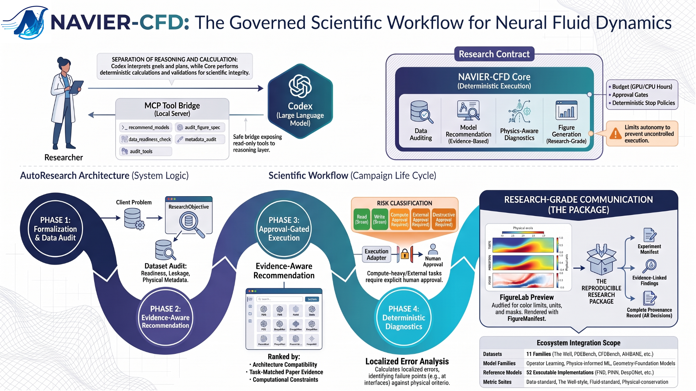

# NAVIER-CFD 中文文档

NAVIER-CFD（**Neural and Agentic Verification, Integration, Evaluation, and Recommendation for Computational Fluid Dynamics**）是一个面向计算流体力学与偏微分方程科学机器学习的统一 Python 平台。

它将模型发现、数据集适配、数据集驱动的模型配置、训练、检查点、CFD 指标、论文证据评分和智能体实验规划连接在同一工作流中。

## 核心能力

- **52 个可执行原生参考模型**：覆盖神经算子、Transformer、图神经网络、物理信息机器学习、生成模型、校正器、预条件器和不确定性量化。
- **55 个统一模型条目**：所有模型均可通过 `ModelHub` 发现和检查。
- **11 个数据集配置文件**：PDEBench、CFDBench、RealPDEBench、The Well、APEBench、ScalarFlow、AirfRANS、DrivAerNet++、DrivAerML、ShapeNet-Car 和 EAGLE。
- **数据集感知导入**：将 `dataset=` 传入 `load_model`，系统会解析维度、通道数、坐标维度、网格表示、谱模态和默认隐藏宽度。
- **统一训练与评估**：支持 Adam、AdamW、SGD、LBFGS、混合精度、早停、检查点和 CFD 专用指标。
- **证据感知推荐**：结合架构兼容性、论文结果、证据质量、覆盖度和置信度推荐模型。


## 安装

```bash
pip install "navier-cfd[models]"
```

仅安装目录、推荐器和数据集工具：

```bash
pip install navier-cfd
```

## 数据集决定模型配置

```python
from navier_cfd import load_model

# 二维结构化 CFD
fno = load_model("fno", dataset="cfdbench")

# 二维点云空气动力学
transolver = load_model("transolver", dataset="airfrans")

# 三维非结构网格车辆空气动力学
gino = load_model("gino", dataset="drivaerml")
```

实际 `CFDSample` 的形状优先于数据集默认值：

```python
model, plan = load_model(
    "pibert",
    dataset="realpdebench",
    sample=sample,
    overrides={"hidden_dim": 256, "num_layers": 8},
    return_plan=True,
)

print(plan.to_dict())
```

## 建议阅读顺序

1. [统一实验流程与 PIBERT](UNIFIED_EXPERIMENTS.md)
2. [数据集配置原生模型套件](NATIVE_MODEL_SUITE.md)
3. [可执行模型中心](MODEL_HUB.md)
4. [数据集目录](DATASET_CATALOG.md)
5. [模型推荐系统](RECOMMENDER.md)
6. [论文证据评分](EVIDENCE_SCORING.md)

!!! note "科学范围"
    NAVIER-CFD 中的“原生参考实现”表示模型能够在统一接口下构建、前向传播、反向传播、训练和保存检查点。它不自动等同于原作者仓库的逐行复现，也不代表已经复现论文中的全部数值结果、私有预处理或检查点。
