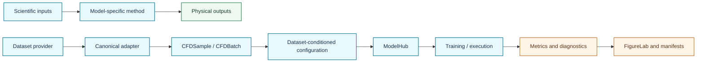

# Model atlas

NAVIER-CFD registers **55 reviewed neural-numerical methods** in a uniform executable catalog. The catalogue covers:

- **Physics-informed:** PINN, NSFnets, PINNsFormer, PINO, PI-MFM, RiemannONet.
- **Deep operator learning:** DeepONet, MIONet, Fourier-DeepONet, Nested Fourier-DeepONet, Fourier-MIONet.
- **Spectral operators:** FNO, F-FNO, U-FNO, U-NO, LSM, MWT, Laplace NO, state-space NO.
- **Geometry and transformers:** Geo-FNO, GINO, GNOT, Galerkin Transformer, FactFormer, ONO, Transolver, UPT, MeshGraphNets, DoMINO, ReViT.
- **CFD-specialized models:** PIBERT, FourierFlow, P3D, AeroTransformer, NeuralDEM, DeepM&Mnet, Energy Transformer.
- **Foundation and generative models:** DPOT, Poseidon, PROSE-FD, BCAT, PDEformer-1, Tadpole, PDE-Refiner, FunDiff, Flow Matching for PDEs.
- **Acceleration frameworks:** Solver-in-the-Loop, INC, PICT, diffSPH, NeuroSEM, neural-operator preconditioned Newton, geometry-aware neural preconditioning.
- **Uncertainty and time adaptation:** Conformalized-DeepONet and TANTE.

Use `navier models list` and `navier models info <id>` for the current machine-readable card.

## Visual architecture cards

The following detailed cards include two diagrams:

1. **Method architecture** — a concise conceptual flow of the scientific method.
2. **NAVIER-CFD library flow** — how canonical data, dataset-conditioned construction, the model hub, training, diagnostics, and FigureLab connect around that model.

| Model card | Scientific role | Registry ID |
|---|---|---|
| [PIBERT](pibert.md) | Multiscale physics-informed CFD transformer | `pibert` |
| [GINO](gino.md) | Geometry-informed neural operator | `gino` |
| [Transolver](transolver.md) | Physics-attention transformer for general geometries | `transolver` |
| [UPT](upt.md) | Representation-flexible latent physics transformer | `upt` |
| [P3D](p3d.md) | High-resolution three-dimensional surrogate | `p3d` |
| [AeroTransformer](aerotransformer.md) | Pretrained three-dimensional aerodynamic transformer | `aerotransformer` |
| [DoMINO](domino.md) | Decomposable multiscale point-cloud operator | `domino` |
| [FourierFlow](fourierflow.md) | Frequency-guided generative flow prediction | `fourierflow` |
| [INC](inc.md) | Equation-level neural corrector | `inc` |
| [PICT](pict.md) | Differentiable multi-block PISO solver | `pict` |
| [Geometry-aware preconditioner](geometry_preconditioner.md) | Learned preconditioning inside an iterative solver | `geometry_preconditioner` |

## Diagram conventions



The method diagram is an explanatory summary, not automatically a claim of exact reproduction. NAVIER-CFD native reference implementations are executable integration models; a paper-level reproduction requires the original architecture, preprocessing, checkpoints, and benchmark settings to be pinned and reported.

## Common executable path

```python
from navier_cfd import load_model

model, build_plan = load_model(
    "transolver",
    dataset="airfrans",
    sample=sample,
    return_plan=True,
)
```

Configuration resolution follows:

```text
explicit constructor arguments
            ↑
user overrides
            ↑
actual CFDSample shape and metadata
            ↑
registered dataset defaults
```

The remaining registered methods are available through the machine-readable catalog and will receive detailed visual cards as their model-specific documentation is expanded.
