# AeroTransformer

**Registry ID:** `aerotransformer`  
**Categories:** foundation, geometry, specialized aerodynamics  
**Architecture:** transformer pretrained on diverse three-dimensional wing geometries and fine-tuned on task-specific designs.

## Method architecture

```mermaid
flowchart LR
    X["3D surface geometry<br/>and operating conditions"] --> E["Surface / point<br/>tokenization"]
    E --> P["Aerodynamic pretraining<br/>across geometries"]
    P --> T["Transformer<br/>global interaction"]
    T --> F["Task-specific<br/>fine-tuning head"]
    F --> Y["Pressure, shear or<br/>aerodynamic quantities"]

    classDef input fill:#ffffff,stroke:#167d9a,stroke-width:1.5px,color:#17324d;
    classDef core fill:#e9f8fb,stroke:#167d9a,stroke-width:1.5px,color:#17324d;
    classDef output fill:#eef8f0,stroke:#34855c,stroke-width:1.5px,color:#173f2b;
    class X input;
    class E,P,T,F core;
    class Y output;
```



The architecture flow is conceptual. Surface sampling, geometric features, pretraining data, and downstream heads must match the implementation used in the study.

## NAVIER-CFD library flow

```mermaid
flowchart LR
    D["Aerodynamic geometry dataset"] --> AD["Point / surface adapter"]
    AD --> S["CFDSample<br/>geometry · conditions · targets"]
    S --> C["Dataset-conditioned configuration<br/>3D · coordinate width · channels · geometry mode"]
    R["Geometry compatibility<br/>and evidence ranking"] --> C
    C --> H["ModelHub.load('aerotransformer')"]
    H --> M["AeroTransformer reference<br/>or official checkpoint adapter"]
    M --> T["Fine-tuning and checkpoints"]
    T --> P["Surface-field prediction"]
    P --> V["Field and integral metrics"]
    V --> F["FigureLab + manifests"]

    classDef data fill:#ffffff,stroke:#506784,stroke-width:1.3px,color:#17263a;
    classDef config fill:#e8f6fb,stroke:#1580a0,stroke-width:1.3px,color:#17324d;
    classDef train fill:#eef8f0,stroke:#34855c,stroke-width:1.3px,color:#173f2b;
    classDef verify fill:#fff4e8,stroke:#c97932,stroke-width:1.3px,color:#5a3518;
    class D,AD,S,R data;
    class C,H,M config;
    class T,P train;
    class V,F verify;
```



```python
from navier_cfd import load_model

model, plan = load_model(
    "aerotransformer",
    dataset="drivaernetpp",
    sample=sample,
    return_plan=True,
)
```

## Cautions

Primarily wing-domain and surface-centric evidence. Transfer to vehicles or volume fields requires new validation.

## Reference

Yang et al., *Towards a Foundation-Model Paradigm for Aerodynamic Prediction in Three-dimensional Design*, AIAA Journal 2026.
