# DoMINO

**Registry ID:** `domino`  
**Categories:** geometry, surrogate, specialized CFD  
**Architecture:** decomposable multiscale iterative neural operator for large engineering point clouds.

## Method architecture

```mermaid
flowchart LR
    X["Large engineering<br/>point cloud"] --> D["Spatial decomposition<br/>into local regions"]
    D --> E["Multiscale local<br/>feature encoders"]
    E --> I["Iterative neural-operator<br/>refinement"]
    I --> A["Regional assembly and<br/>global consistency"]
    A --> Y["Predicted engineering fields"]

    classDef input fill:#ffffff,stroke:#167d9a,stroke-width:1.5px,color:#17324d;
    classDef core fill:#e9f8fb,stroke:#167d9a,stroke-width:1.5px,color:#17324d;
    classDef output fill:#eef8f0,stroke:#34855c,stroke-width:1.5px,color:#173f2b;
    class X input;
    class D,E,I,A core;
    class Y output;
```



The diagram captures the decomposed multiscale concept. Region construction, overlap, iteration count, geometric features, and assembly rules must follow the selected implementation.

## NAVIER-CFD library flow

```mermaid
flowchart LR
    D["Large point-cloud dataset"] --> AD["Canonical geometry adapter"]
    AD --> S["CFDSample<br/>points · fields · masks · parameters"]
    S --> C["Dataset-conditioned configuration<br/>3D · channels · point count · geometry mode"]
    B["Memory budget and<br/>geometry-transfer requirement"] --> C
    C --> H["ModelHub.load('domino')"]
    H --> M["DoMINO reference path<br/>or reviewed external adapter"]
    M --> T["Training + checkpoints"]
    T --> P["Decomposed field prediction"]
    P --> V["Field, integral and<br/>cross-geometry metrics"]
    V --> F["FigureLab + manifests"]

    classDef data fill:#ffffff,stroke:#506784,stroke-width:1.3px,color:#17263a;
    classDef config fill:#e8f6fb,stroke:#1580a0,stroke-width:1.3px,color:#17324d;
    classDef train fill:#eef8f0,stroke:#34855c,stroke-width:1.3px,color:#173f2b;
    classDef verify fill:#fff4e8,stroke:#c97932,stroke-width:1.3px,color:#5a3518;
    class D,AD,S,B data;
    class C,H,M config;
    class T,P train;
    class V,F verify;
```



```python
from navier_cfd import load_model

model, plan = load_model(
    "domino",
    dataset="drivaerml",
    sample=sample,
    return_plan=True,
)
```

## Suitable tasks

Three-dimensional industrial aerodynamics and large point-cloud simulations.

## Reference

Ranade et al., *DoMINO*, 2025.
