# FourierFlow

**Registry ID:** `fourierflow`  
**Categories:** surrogate, generative, specialized CFD  
**Architecture:** frequency-guided flow model for fluid-field prediction.

## Method architecture


The scientific diagram summarizes a frequency-guided forecasting path. The exact flow objective, spectral representation, conditioning, and sampling procedure depend on the pinned implementation.

## NAVIER-CFD library flow

```mermaid
flowchart LR
    D["Temporal CFD provider"] --> AD["Canonical trajectory adapter"]
    AD --> S["CFDSample<br/>history · target · coordinates"]
    S --> C["Dataset-conditioned configuration<br/>channels · history · spatial dimension"]
    R["Long-rollout and<br/>uncertainty requirements"] --> C
    C --> H["ModelHub.load('fourierflow')"]
    H --> M["FourierFlow reference<br/>or reviewed implementation"]
    M --> T["Training + checkpoints"]
    T --> P["Autoregressive prediction"]
    P --> V["RMSE, spectral and<br/>rollout-stability metrics"]
    V --> F["FigureLab + manifests"]

    classDef data fill:#ffffff,stroke:#506784,stroke-width:1.3px,color:#17263a;
    classDef config fill:#e8f6fb,stroke:#1580a0,stroke-width:1.3px,color:#17324d;
    classDef train fill:#eef8f0,stroke:#34855c,stroke-width:1.3px,color:#173f2b;
    classDef verify fill:#fff4e8,stroke:#c97932,stroke-width:1.3px,color:#5a3518;
    class D,AD,S,R data;
    class C,H,M config;
    class T,P train;
    class V,F verify;
```



```python
from navier_cfd import load_model

model, plan = load_model(
    "fourierflow",
    dataset="realpdebench",
    sample=sample,
    return_plan=True,
)
```

## Suitable tasks

Autoregressive flow forecasting, reconstruction, and RealPDEBench sim-to-real studies.

## Strengths

Frequency-aware dynamics and strong real-flow baseline behavior.

## Cautions

Pin the exact implementation, checkpoint, and paper/version used in each study.

## Usage

```bash
navier models info fourierflow
```

## Reference

FourierFlow baseline used in PIBERT RealPDEBench evaluations.
