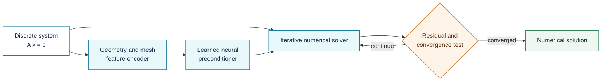

# Geometry-Aware Neural Preconditioner

**Registry ID:** `geometry_preconditioner`  
**Categories:** acceleration, geometry  
**Architecture:** learned geometry-conditioned preconditioner embedded in an iterative numerical solver.

## Method architecture

The numerical residual and stopping criterion remain explicit. The learned component accelerates the solver but does not remove the solver's convergence check.

## NAVIER-CFD library flow

```mermaid
flowchart LR
    D["Matrices, meshes and<br/>solver histories"] --> AD["Canonical acceleration adapter"]
    AD --> S["CFDSample + geometry<br/>and linear-system metadata"]
    S --> C["Dataset-conditioned configuration<br/>dimension · mesh · feature width"]
    B["Matched tolerance and<br/>wall-clock benchmark plan"] --> C
    C --> H["ModelHub.load('geometry_preconditioner')"]
    H --> M["Neural preconditioner"]
    M --> E["Approved iterative-solver adapter"]
    E --> P["Converged solution and<br/>iteration history"]
    P --> V["Residual, iteration-count and<br/>wall-clock evaluation"]
    V --> F["Figures + experiment manifest"]

    classDef data fill:#ffffff,stroke:#506784,stroke-width:1.3px,color:#17263a;
    classDef config fill:#e8f6fb,stroke:#1580a0,stroke-width:1.3px,color:#17324d;
    classDef execute fill:#eef8f0,stroke:#34855c,stroke-width:1.3px,color:#173f2b;
    classDef verify fill:#fff4e8,stroke:#c97932,stroke-width:1.3px,color:#5a3518;
    class D,AD,S,B data;
    class C,H,M config;
    class E,P execute;
    class V,F verify;
```

!!! warning "Fair acceleration evidence"
    Compare methods at matched residual tolerance and report setup cost, iteration count, convergence failures, and wall-clock time across held-out geometries and meshes.

## Value

The discrete residual and convergence criterion remain available, making this class attractive for trustworthy CFD acceleration.

## Required evidence

Cross-mesh, cross-geometry, solver-setting, Reynolds-number, iteration-count, and wall-clock tests.

## Reference

Lee et al., geometry-aware hybrid iterative solvers, 2025.
