# Geometry-Informed Neural Operator

**Registry ID:** `gino`  
**Categories:** geometry, surrogate  
**Architecture:** graph lifting to a latent regular domain, Fourier operator processing, and pointwise projection.

## Method architecture

```mermaid
flowchart LR
    X["Unstructured mesh or<br/>point-cloud fields"] --> G["Geometry-aware<br/>graph lifting"]
    G --> L["Latent regular-grid<br/>representation"]
    L --> O["Fourier neural-operator<br/>blocks"]
    O --> P["Pointwise projection<br/>to physical geometry"]
    P --> Y["Predicted CFD fields"]

    classDef input fill:#ffffff,stroke:#167d9a,stroke-width:1.5px,color:#17324d;
    classDef core fill:#e9f8fb,stroke:#167d9a,stroke-width:1.5px,color:#17324d;
    classDef output fill:#eef8f0,stroke:#34855c,stroke-width:1.5px,color:#173f2b;
    class X input;
    class G,L,O,P core;
    class Y output;
```



This is the conceptual GINO path. Geometry encoding, neighbourhood construction, latent-grid resolution, and interpolation rules must be reported for each experiment.

## NAVIER-CFD library flow

```mermaid
flowchart LR
    D["Mesh / point-cloud provider"] --> AD["Canonical adapter"]
    AD --> S["CFDSample<br/>fields · coordinates · masks"]
    S --> C["Dataset-conditioned configuration<br/>3D · channels · coordinate width · mesh type"]
    R["TaskSpec + compatibility<br/>filtering"] --> C
    C --> H["ModelHub.load('gino')"]
    H --> M["GINO native reference<br/>or reviewed external adapter"]
    M --> T["CFDTrainer.fit<br/>checkpoints"]
    T --> Q["Geometry-conditioned prediction"]
    Q --> V["Field, profile and<br/>physics-aware metrics"]
    V --> F["FigureLab + manifests"]

    classDef data fill:#ffffff,stroke:#506784,stroke-width:1.3px,color:#17263a;
    classDef config fill:#e8f6fb,stroke:#1580a0,stroke-width:1.3px,color:#17324d;
    classDef train fill:#eef8f0,stroke:#34855c,stroke-width:1.3px,color:#173f2b;
    classDef verify fill:#fff4e8,stroke:#c97932,stroke-width:1.3px,color:#5a3518;
    class D,AD,S,R data;
    class C,H,M config;
    class T,Q train;
    class V,F verify;
```



```python
from navier_cfd import load_model

model, plan = load_model(
    "gino",
    dataset="drivaerml",
    sample=sample,
    return_plan=True,
)
```

!!! note "Reference implementation scope"
    NAVIER-CFD may provide an executable native reference family for integration testing. Claims of numerical reproduction require the official GINO implementation, pinned preprocessing, and matched benchmark settings.

## Suitable tasks

Large-scale three-dimensional aerodynamic and geometry-dependent PDE surrogates.

## Cautions

Memory, preprocessing, boundary encoding, and cross-mesher transfer require explicit reporting.

## Reference

Li et al., *Geometry-Informed Neural Operator for Large-Scale 3D PDEs*, NeurIPS 2023.
