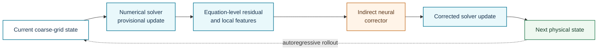

# Indirect Neural Corrector

**Registry ID:** `inc`  
**Categories:** acceleration, physics-informed  
**Architecture:** equation-level corrector inserted into an autoregressive hybrid PDE solver rather than a direct state overwrite.

## Method architecture

Unlike direct state replacement, the learned component corrects an equation-level numerical update. Solver discretization and correction placement therefore form part of the model definition.

## NAVIER-CFD library flow

```mermaid
flowchart LR
    D["Solver trajectories<br/>and correction targets"] --> AD["Canonical hybrid adapter"]
    AD --> S["CFDSample<br/>state · residual · parameters"]
    S --> C["Dataset-conditioned configuration<br/>dimension · channels · rollout history"]
    B["Matched-error and<br/>wall-clock benchmark plan"] --> C
    C --> H["ModelHub.load('inc')"]
    H --> M["INC model or<br/>approved external adapter"]
    M --> E["Explicit solver-coupled executor"]
    E --> P["Corrected rollout"]
    P --> V["Accuracy, stability and<br/>wall-clock evaluation"]
    V --> F["Figures + experiment manifest"]

    classDef data fill:#ffffff,stroke:#506784,stroke-width:1.3px,color:#17263a;
    classDef config fill:#e8f6fb,stroke:#1580a0,stroke-width:1.3px,color:#17324d;
    classDef execute fill:#eef8f0,stroke:#34855c,stroke-width:1.3px,color:#173f2b;
    classDef verify fill:#fff4e8,stroke:#c97932,stroke-width:1.3px,color:#5a3518;
    class D,AD,S,B data;
    class C,H,M config;
    class E,P execute;
    class V,F verify;
```

!!! warning "Execution boundary"
    NAVIER-CFD v1.1.0 can describe and evaluate this integration, but solver execution must occur through an explicit approved adapter; it is not an automatic read-only MCP action.

## Suitable tasks

Stable coarse-grid correction and long-horizon neural-numerical acceleration up to three-dimensional turbulence.

## Cautions

Requires integration with a numerical solver and matched-error wall-clock evaluation.

## Reference

Wei, Franz, List & Thuerey, *INC*, NeurIPS 2025. Code: https://github.com/tum-pbs/INC
