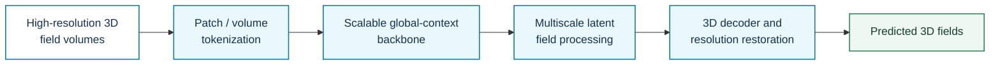

# P3D

**Registry ID:** `p3d`  
**Categories:** surrogate, foundation, specialized CFD  
**Architecture:** scalable global-context surrogate for high-resolution three-dimensional PDE simulations.

## Method architecture



This conceptual diagram emphasizes the high-resolution volumetric path. Exact tokenization, context blocks, and scaling strategy must follow the selected P3D implementation.

## NAVIER-CFD library flow

```mermaid
flowchart LR
    D["3D trajectory provider"] --> AD["Canonical volumetric adapter"]
    AD --> S["CFDSample<br/>3D fields · coordinates · metadata"]
    S --> C["Dataset-conditioned configuration<br/>3D · channels · history · resolution"]
    B["Memory and budget constraints"] --> C
    C --> H["ModelHub.load('p3d')"]
    H --> M["P3D native reference<br/>and ModelBuildPlan"]
    M --> T["Mixed-precision training<br/>checkpoints"]
    T --> P["3D prediction / rollout"]
    P --> V["Metrics, spectra and<br/>stability diagnostics"]
    V --> F["FigureLab + manifests"]

    classDef data fill:#ffffff,stroke:#506784,stroke-width:1.3px,color:#17263a;
    classDef config fill:#e8f6fb,stroke:#1580a0,stroke-width:1.3px,color:#17324d;
    classDef train fill:#eef8f0,stroke:#34855c,stroke-width:1.3px,color:#173f2b;
    classDef verify fill:#fff4e8,stroke:#c97932,stroke-width:1.3px,color:#5a3518;
    class D,AD,S,B data;
    class C,H,M config;
    class T,P train;
    class V,F verify;
```



```python
from navier_cfd import load_model

model, plan = load_model(
    "p3d",
    dataset="scalarflow",
    sample=sample,
    return_plan=True,
)
```

!!! note "Reference implementation scope"
    The NAVIER-CFD native reference path validates the common data, training, checkpoint, and evaluation contracts. Reproduction claims require the official P3D architecture and pinned experimental settings.

## Cautions

High memory requirements and a still-emerging independent evidence base.

## Reference

Holzschuh et al., *P3D*, ICLR 2026.
