# PIBERT

**Registry ID:** `pibert`  
**Categories:** surrogate, physics-informed, specialized CFD  
**Architecture:** bidirectional transformer with hybrid Fourier-wavelet embeddings, physics-biased attention, masked-physics prediction, and equation-consistency pretraining.

## Method architecture


The diagram summarizes the scientific method. Exact block definitions, loss terms, and preprocessing must follow the pinned PIBERT implementation and experiment configuration.

## NAVIER-CFD library flow

```mermaid
flowchart LR
    D["Dataset provider"] --> AD["Canonical adapter"]
    AD --> S["CFDSample / CFDBatch"]
    S --> C["Dataset-conditioned configuration<br/>dimension · channels · coordinates · history"]
    R["TaskSpec + evidence-aware<br/>recommendation"] --> C
    C --> H["ModelHub.load('pibert')"]
    H --> P["PIBERT builder<br/>and ModelBuildPlan"]
    P --> T["CFDTrainer.fit<br/>checkpoints"]
    T --> Q["Prediction / rollout"]
    Q --> V["MetricSuite + CFD diagnostics"]
    V --> F["FigureLab + experiment manifests"]

    classDef data fill:#ffffff,stroke:#506784,stroke-width:1.3px,color:#17263a;
    classDef config fill:#e8f6fb,stroke:#1580a0,stroke-width:1.3px,color:#17324d;
    classDef train fill:#eef8f0,stroke:#34855c,stroke-width:1.3px,color:#173f2b;
    classDef verify fill:#fff4e8,stroke:#c97932,stroke-width:1.3px,color:#5a3518;
    class D,AD,S,R data;
    class C,H,P config;
    class T,Q train;
    class V,F verify;
```



```python
from navier_cfd import load_model

model, plan = load_model(
    "pibert",
    dataset="realpdebench",
    sample=sample,
    return_plan=True,
)
```

## Suitable tasks

Multiscale CFD surrogates, flow reconstruction, and sim-to-real forecasting.

## Demonstrated settings

1D–3D; structured grids; steady and autoregressive regimes; incompressible flow and fluid–structure interaction.

## Strengths

Global/local spectral representation, physics-biased attention, and self-supervised pretraining.

## Cautions

Full 3D training is memory intensive. Benchmark claims should be reproduced with pinned data and code revisions.

## Usage

```bash
navier models info pibert
navier recommend --problem cylinder_wake --task surrogate --dimension 2 --temporal autoregressive
```

## Reference

Chakraborty, Pan & Chen, *PIBERT: A Physics-Informed Bi-directional Hybrid Spectral Transformer for Multiscale CFD Surrogate Modeling*, 2026. Official implementation: https://github.com/Samsomyajit/pibert
