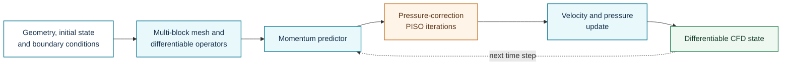

# PICT

**Registry ID:** `pict`  
**Categories:** acceleration, specialized, physics-informed  
**Architecture:** differentiable GPU-accelerated multi-block PISO CFD solver.

## Method architecture

PICT is a differentiable solver framework rather than a stand-alone direct surrogate. The numerical scheme, mesh blocks, linear solvers, and differentiable components must be described as part of the method.

## NAVIER-CFD library flow

```mermaid
flowchart LR
    D["Case metadata and<br/>solver trajectories"] --> AD["Canonical solver adapter"]
    AD --> S["CFDSample + solver context"]
    S --> C["Task and case configuration<br/>mesh · fields · BCs · time step"]
    G["ResearchContract<br/>compute and approval rules"] --> C
    C --> H["ModelHub / external PICT adapter"]
    H --> E["Approved differentiable<br/>solver execution"]
    E --> P["State prediction and gradients"]
    P --> V["Residual, conservation,<br/>accuracy and wall-clock metrics"]
    V --> F["FigureLab + manifests"]

    classDef data fill:#ffffff,stroke:#506784,stroke-width:1.3px,color:#17263a;
    classDef config fill:#e8f6fb,stroke:#1580a0,stroke-width:1.3px,color:#17324d;
    classDef execute fill:#eef8f0,stroke:#34855c,stroke-width:1.3px,color:#173f2b;
    classDef verify fill:#fff4e8,stroke:#c97932,stroke-width:1.3px,color:#5a3518;
    class D,AD,S,G data;
    class C,H config;
    class E,P execute;
    class V,F verify;
```

!!! warning "Execution boundary"
    PICT execution is an explicit solver action. NAVIER-CFD's current read-only MCP tools do not launch it automatically.

## Suitable tasks

Simulation-coupled learning, inverse problems, control, and learned CFD components.

## Reference

Franz et al., *PICT*, Journal of Computational Physics, 2025.
