# Transolver

**Registry ID:** `transolver`  
**Categories:** geometry, surrogate, general PDE solver  
**Architecture:** physics-attention slices over arbitrary points.

## Method architecture

```mermaid
flowchart LR
    X["Points, geometry,<br/>boundary conditions"] --> E["Feature and coordinate<br/>embedding"]
    E --> S["Physics-attention<br/>slice construction"]
    S --> T["Transformer processing<br/>in latent slices"]
    T --> R["Slice-to-point<br/>restoration"]
    R --> Y["Predicted physical fields"]

    classDef input fill:#ffffff,stroke:#167d9a,stroke-width:1.5px,color:#17324d;
    classDef core fill:#e9f8fb,stroke:#167d9a,stroke-width:1.5px,color:#17324d;
    classDef output fill:#eef8f0,stroke:#34855c,stroke-width:1.5px,color:#173f2b;
    class X input;
    class E,S,T,R core;
    class Y output;
```



The method diagram is conceptual. Slice construction, boundary encoding, neighbourhood semantics, and resolution transfer remain experiment-specific.

## NAVIER-CFD library flow

```mermaid
flowchart LR
    D["Structured, mesh or<br/>point-cloud dataset"] --> AD["Canonical adapter"]
    AD --> S["CFDSample<br/>fields · coordinates · mask"]
    S --> C["Dataset-conditioned configuration<br/>dimension · channels · coordinate width"]
    K["Compatibility rules<br/>geometry and mesh transfer"] --> C
    C --> H["ModelHub.load('transolver')"]
    H --> M["Transolver reference builder<br/>or external integration"]
    M --> T["CFDTrainer.fit"]
    T --> P["Pointwise field prediction"]
    P --> V["MetricSuite + geometry-aware diagnostics"]
    V --> F["FigureLab + manifests"]

    classDef data fill:#ffffff,stroke:#506784,stroke-width:1.3px,color:#17263a;
    classDef config fill:#e8f6fb,stroke:#1580a0,stroke-width:1.3px,color:#17324d;
    classDef train fill:#eef8f0,stroke:#34855c,stroke-width:1.3px,color:#173f2b;
    classDef verify fill:#fff4e8,stroke:#c97932,stroke-width:1.3px,color:#5a3518;
    class D,AD,S,K data;
    class C,H,M config;
    class T,P train;
    class V,F verify;
```



```python
from navier_cfd import load_model

model, plan = load_model(
    "transolver",
    dataset="airfrans",
    sample=sample,
    return_plan=True,
)
```

## Suitable tasks

General-geometry CFD surrogates and aerodynamic design on structured, unstructured, and point-cloud representations.

## Cautions

Boundary semantics and mesh-generation dependence remain benchmark-specific.

## Reference

Wu et al., *Transolver: A Fast Transformer Solver for PDEs on General Geometries*, ICML 2024. Official integration source: https://github.com/thuml/Neural-Solver-Library
