# Universal Physics Transformer

**Registry ID:** `upt`  
**Categories:** foundation, geometry, surrogate, general PDE solver  
**Architecture:** latent transformer accepting grids, meshes, point clouds, and particles.

## Method architecture

```mermaid
flowchart LR
    X["Grid · mesh · point cloud<br/>or particle state"] --> A["Representation-specific<br/>input adapter"]
    A --> L["Shared latent<br/>physics tokens"]
    L --> T["Universal transformer<br/>backbone"]
    T --> Q["Task and query-specific<br/>decoder"]
    Q --> Y["Predicted physical fields"]

    classDef input fill:#ffffff,stroke:#167d9a,stroke-width:1.5px,color:#17324d;
    classDef core fill:#e9f8fb,stroke:#167d9a,stroke-width:1.5px,color:#17324d;
    classDef output fill:#eef8f0,stroke:#34855c,stroke-width:1.5px,color:#173f2b;
    class X input;
    class A,L,T,Q core;
    class Y output;
```



The method diagram shows the representation-to-latent-to-query abstraction. Pretraining corpora, normalization, token budgets, and decoder choices remain implementation-specific.

## NAVIER-CFD library flow

```mermaid
flowchart LR
    D["Heterogeneous scientific dataset"] --> AD["Canonical adapter"]
    AD --> S["CFDSample<br/>fields · points · masks · coordinates"]
    S --> C["Dataset-conditioned configuration<br/>representation · dimensions · channels · sensors"]
    R["TaskSpec + model compatibility"] --> C
    C --> H["ModelHub.load('upt')"]
    H --> M["UPT native reference<br/>or official adapter"]
    M --> T["CFDTrainer.fit"]
    T --> P["Query-conditioned prediction"]
    P --> V["Cross-representation metrics"]
    V --> F["FigureLab + manifests"]

    classDef data fill:#ffffff,stroke:#506784,stroke-width:1.3px,color:#17263a;
    classDef config fill:#e8f6fb,stroke:#1580a0,stroke-width:1.3px,color:#17324d;
    classDef train fill:#eef8f0,stroke:#34855c,stroke-width:1.3px,color:#173f2b;
    classDef verify fill:#fff4e8,stroke:#c97932,stroke-width:1.3px,color:#5a3518;
    class D,AD,S,R data;
    class C,H,M config;
    class T,P train;
    class V,F verify;
```



```python
from navier_cfd import load_model

model, plan = load_model("upt", dataset="airfrans", sample=sample, return_plan=True)
```

## Strengths

Representation flexibility and scalable latent tokens.

## Cautions

Large pretraining budget and nontrivial cross-domain normalization.

## Reference

Alkin et al., *Universal Physics Transformers*, NeurIPS 2024.
